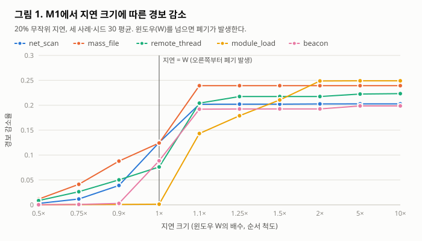
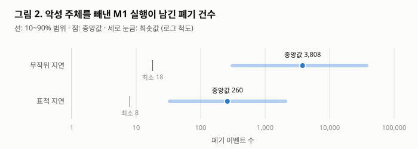
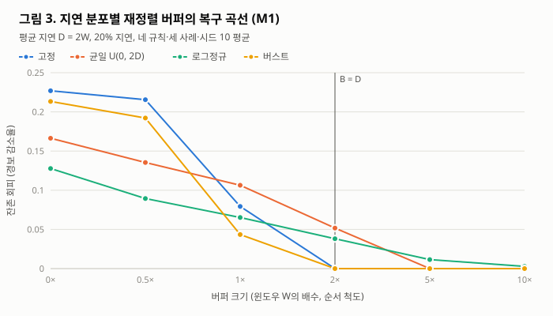

# 발생 시각인가, 수집 시각인가: 텔레메트리 도착 지연이 시간 윈도우 탐지의 누락과 그 흔적을 바꾸는 방식

작성자: 반소람

2026년 9월 13일

---

## 초록

보안 관제의 탐지 규칙은 흔히 "W초 안에 같은 주체의 이벤트 N건 이상"과 같은 시간 윈도우 임계 형태를 띤다. 이런 규칙은 이벤트가 발생한 순서대로 도착한다고 암묵적으로 전제한다. 그러나 실제 로그 파이프라인은 에이전트 버퍼, 배치 전송, 메시지 큐, 재시도와 백프레셔를 거치며 이벤트마다 다른 지연을 만든다. 본 연구는 이벤트를 하나도 삭제하지 않고 도착만 늦추는 조작이 탐지를 얼마나 무너뜨리는지, 그리고 그 흔적이 남는지를 공개 엔드포인트 텔레메트리(DARPA OpTC)의 세 공격 사례와 규칙 다섯 종으로 측정했다. 지연은 실제 파이프라인에서 관측한 것이 아니라 기록된 로그에 여러 분포로 인위적으로 주입한 것이며, 공격자가 그런 지연을 실제로 유발할 수 있는지는 다루지 않는다.

핵심 결과는 이렇다. **같은 도착 지연이라도 탐지 엔진이 센서의 발생 시각을 보존하느냐, 수집 시점을 이벤트 시각으로 쓰느냐에 따라 탐지 누락의 형태와 그 관측 가능성이 근본적으로 달라진다.** 여기서 흔적은 탐지 엔진이 늦은 이벤트를 폐기한 수만을 뜻하며, 대기열·전송 지연 같은 다른 운영 지표는 측정하지 않았다. 수집 시점을 쓰는 구성(M2)에서는 이 폐기가 원리적으로 없는데도 경보가 최대 22% 줄고 탐지 주체가 흔하게 빠졌으며, 악성 주체 회피율은 최대 57%(무작위 지연, 기준 악성 주체 7명 중 4명)였다. 발생 시각을 보존하는 구성(M1)에서는 주체 단위 누락이 반드시 폐기와 함께 나타났다. 윈도우 이하의 지연은 폐기 없이 경보를 최대 16% 줄였지만 10,800회 실행에서 주체를 하나도 빼내지 못했고, 윈도우를 크게 넘는 지연은 대부분의 조건에서 이벤트 삭제와 거의 같은 효과(135셀 중 97%에서 차이 0.01 이내)와 폐기 기록을 남겼다. 그러나 공격자가 자신의 이벤트만 골라 지연시키면, 빼내는 악성 주체 수는 늘지 않았지만(주 분석 315셀 중 표적 우위 0) 남기는 폐기는 같은 조건의 무작위 지연보다 중앙값 기준 약 18분의 1(중앙값 260건, 최소 8건)로 줄었다. 이 은밀성 이득은 공격자가 자기 프로세스의 이벤트만 골라 지연시킬 수 있다는 강한 가정에서 나온 것이다. 평가한 다섯 규칙에서는 취약도 순위도 두 구성에서 반대 방향이었다(ρ = −0.61).

발생 시각 기준 재정렬 버퍼는 규칙 입력에 발생 시각이 남아 있는 M1에서만 쓸 수 있다. 버퍼가 최대 지연을 덮으면 설계상 완전히 복구되며, 그 아래에서는 고정 지연이 계단 모양, 로그정규 지연이 점진적 복구를 보였다. 부분 버퍼가 회피를 악화시킨 경우는 없었다. 연구 도중 규칙 엔진의 장부 처리 버그가 일부 효과를 약 10배 부풀렸음을 발견했다(예: 38% → 3.8%). 엔진을 고치고 가설과 판정 기준을 사전 등록한 뒤 82,890회를 다시 측정했으며, 버그로 무효가 된 주장과 정정 경위를 모두 보고한다.

**핵심어**: 침입 탐지, 로그 파이프라인, 이벤트 시각, 스트림 처리, 탐지 회피, 사전 등록

---

## I. 서론

침입 탐지와 보안 관제는 개별 이벤트가 아니라 이벤트의 패턴으로 공격을 식별한다. 그 패턴의 상당수는 시간 윈도우로 표현된다. 짧은 시간에 반복되는 인증 실패, 좁은 구간에 몰린 대량 파일 접근, 일정 주기로 반복되는 외부 연결이 그러하다. 이런 규칙은 흔히 "어떤 키를 공유하는 이벤트가 W초 안에 N건 이상이면 경보"라는 임계 형태로 표현된다. 본 연구는 이 형태가 실무 규칙에서 차지하는 비중을 조사하지 않았으며, 이 형태의 규칙이 도착 지연에 어떻게 반응하는지만 다룬다.

이 규칙들은 한 가지를 조용히 전제한다. **이벤트가 발생한 순서대로, 발생한 시각에 맞추어 도착한다는 것이다.** 그러나 현대 로그 파이프라인은 이를 보장하지 않는다. 엔드포인트 에이전트는 이벤트를 로컬 버퍼에 모아 배치로 전송하고, 수집기는 메시지 큐에 적재하며, 스트림 처리기나 SIEM이 이를 소비한다. 버퍼가 비워지는 시점, 전송 재시도와 백오프, 큐의 백프레셔, 다중 소스의 병합이 같은 순간에 발생한 이벤트를 서로 다른 시각에 도착시킨다.

본 연구의 질문은 다음과 같다. **공격자가 파이프라인 지연을 유발해 자신의 이벤트를 탐지 윈도우 밖으로 밀어낼 수 있는가, 그리고 그 조작은 흔적을 남기는가.** 지연이 로그의 삭제나 변조 없이 일어난다면, 모든 로그가 결국 도착하므로 로그의 완전성과 무결성만 보는 감시로는 이를 구별할 수 없다.

기존의 로그 조작 위협 연구는 대부분 이벤트의 삭제나 변조를 다룬다. 감사 레코드가 사라지면 프로비넌스 그래프의 인과 경로가 끊기고 거짓 음성이 생긴다는 것은 알려져 있다. 그러나 이벤트를 그대로 두고 **도착만 늦추는** 조작이 탐지에 미치는 영향은 충분히 다루어지지 않았다.

본 연구는 이 질문을 공개 엔드포인트 텔레메트리 데이터셋(DARPA OpTC)으로 검증한다. 이 데이터는 실제 공격 시나리오가 포함된 호스트 이벤트 로그와 악성 이벤트 정답을 제공하므로, 지연이 공격 탐지에 주는 영향을 정답과 대조해 측정할 수 있다.

본 논문의 기여는 다음과 같다.

1. **시각 의미론에 따른 누락 형태와 관측 가능성의 분리.** 탐지 엔진이 수집 시점을 이벤트 시각으로 쓰는 구성(M2)과 발생 시각을 보존하는 구성(M1)을 나누어 측정했다. M2에서는 폐기 지표에 흔적 없이 주체 단위 누락이 생겼고, M1에서는 측정한 모든 실행에서 주체 단위 누락이 폐기와 결합되었다. 이 결과는 발화 후 상태를 초기화하지 않는 엔진에서도 주체 단위로 같았다. 평가한 규칙의 취약도 순위도 두 구성에서 반대 방향이었다.

2. **표적 지연의 이중성.** 부트스트랩 동등성 판정으로, 공격자가 자기 이벤트만 지연시키는 전략이 두 구성 모두에서 악성 주체를 더 많이 빼내지는 못하지만 M1에서 남기는 폐기 흔적은 크게 줄인다는 것을 보인다. 정밀한 지연 제어는 회피의 양이 아니라 은밀성을 산다.

3. **재정렬 완화의 경계.** 버퍼가 최대 지연을 덮을 때의 완전 복구가 설계상 보장됨을 증명하고, 그 아래의 복구가 지연 분포에 따라 계단형과 점진형으로 갈림을 측정한다. 발생 시각 보존, 폐기 이벤트 감시, 버퍼라는 세 방어가 서로를 보완하는 구조와 그 한계를 제시한다.

4. **측정 도구 자체의 오류와 그 정정.** 규칙 엔진의 장부 처리 버그가 효과를 약 10배 부풀린 과정과, 이를 발견한 뒤 사전 등록으로 재측정한 절차를 보고한다. 스트리밍 탐지를 모의 실험하는 연구에서 순서에 민감한 상태 관리가 결론을 좌우할 수 있다는 교훈이다.

이후 II장에서 배경과 관련 연구를, III장에서 위협 모델을, IV장에서 실험 설계를, V장에서 취약성 결과를, VI장에서 완화를, VII장에서 논의·한계·정정 기록을 다룬다.

---

## II. 배경 및 관련 연구

### 1. 시간 윈도우 기반 탐지 규칙

보안 관제에서 상관 규칙(correlation rule)은 여러 이벤트를 묶어 하나의 판정을 내린다. 그중 널리 쓰이는 형태가 시간 윈도우 임계 규칙이다. 특정 속성(사용자, 프로세스, 목적지 등)을 공유하는 이벤트가 정해진 시간 구간에 정해진 횟수 이상 나타나면 경보를 낸다. 무차별 대입 로그인 탐지, 포트 스캔 탐지, 데이터 유출 징후 탐지, C2 비컨 탐지가 이 형태로 표현된다.

이 규칙의 판정은 이벤트의 **시각과 순서**에 직접 의존한다. 스트림 처리 관점에서 이 규칙은 상태를 무한히 보관할 수 없으므로 오래된 상태를 회수(retire)해야 한다. 회수 시점을 정하는 것이 워터마크(watermark)이며, 늦게 도착한 이벤트를 얼마나 기다려 줄지는 허용 지연(allowed lateness)으로 조절한다. 이런 장치가 필요하다는 사실 자체가 이벤트가 순서대로 도착하지 않는다는 현실을 반영한다.

스트림 처리 연구는 이 문제를 오래 다루어 왔다. Dataflow 모델은 순서가 보장되지 않는 무한 데이터에서 이벤트 시각 기준의 정렬과 창 계산을 요구하는 현실과, 정확성·지연·비용을 동시에 최적화할 수 없다는 긴장을 정식화했다 [9]. MillWheel은 논리적 시각 개념으로 시간 기반 집계를 지원하는 대규모 스트림 처리 프레임워크를 제시했다 [10]. Li 등은 입력 순서를 강제해 연산자의 차단을 풀고 상태를 회수하는 방식의 비용을 지적하고, 순서를 강제하지 않는 처리 구조를 제안했다 [11]. 이 연구들은 늦은 이벤트를 **정확하고 효율적으로 처리하는 방법**을 다룬다. 본 연구는 같은 메커니즘을 반대편에서 본다. 공격자가 지연을 의도적으로 유발할 때 보안 탐지 규칙의 판정과 그 관측 가능성이 어떻게 달라지는지다.

### 2. 프로비넌스 기반 침입 탐지와 로그 완전성

운영체제 감사 로그를 객체와 행위자의 관계로 연결한 프로비넌스 그래프는 공격의 인과관계와 장거리 의존관계를 표현하는 데 쓰인다 [1]. 그러나 그 설명력은 수집된 이벤트에 의존한다. 감사 레코드가 누락되면 인과 경로가 끊기고, 손상된 실행이 정상 실행과 구분되지 않아 거짓 음성이 생길 수 있다 [2], [3]. 이러한 연구는 로그의 **완전성**이 탐지에 중요함을 보였다.

로그 축약 연구는 분석 의미를 보존하면서 로그 양을 줄이는 방법을 다룬다 [4], [5]. 이들은 어떤 이벤트를 버려도 되는지가 분석 방법에 따라 다르며, 일반적 보안 분석을 지원하려면 손실 없는 압축이 필요하다고 지적한다. 이 논의의 초점 역시 이벤트의 **존재 여부**에 있다.

최근의 프로비넌스 기반 침입 탐지 시스템은 감사 이벤트의 시간적 변화를 학습해 이상 점수를 계산한다 [6]. 여러 시스템을 공통 파이프라인에서 비교한 연구는 공격 단위 성능 평가와, 결과를 본 뒤 임계값을 조정하는 데이터 누출의 위험을 지적했다 [7]. 이들 연구는 탐지 모델의 정확도와 평가 방법론을 다루지만, 입력 이벤트의 **도착 시각**이 판정에 미치는 영향은 주된 대상이 아니다.

기존 연구가 이벤트의 존재(완전성)와 내용(무결성)을 다루었다면, 본 연구는 이벤트가 모두 존재하고 내용도 온전한 상태에서 **도착만 늦어질 때** 탐지가 어떻게 달라지는지를 다룬다.

이 질문에는 네트워크 침입 탐지 회피 연구라는 계보가 있다. Handley 등은 숙련된 공격자가 모니터가 보는 트래픽 스트림의 모호함을 이용해 탐지를 회피할 수 있다는 문제를 다루고, 트래픽이 모니터에 닿기 전에 경로에서 스트림을 고쳐 모호함을 없애는 정규화기(normalizer)를 제안했다 [12]. 본 연구의 재정렬 버퍼는 같은 발상을 호스트 텔레메트리의 시각 모호함에 적용한 것으로 볼 수 있다. 차이는 모호함의 원천이다. 네트워크 회피는 패킷 해석의 모호함을 이용하지만, 본 연구는 로그 파이프라인이 만드는 발생 시각과 도착 시각의 불일치를 다룬다.

### 3. 평가 데이터셋

DARPA OpTC(Operationally Transparent Cyber)는 Windows 엔드포인트에서 수집한 대규모 호스트 이벤트 로그와 레드팀 공격 시나리오, 악성 이벤트 정답을 제공한다 [8]. 각 이벤트는 발생 시각, 호스트, 프로세스, 객체·행위 유형을 담는다. 본 연구는 원본의 식별자 불일치 등을 보정한 배포본을 사용하며, 세 공격 시나리오의 핵심 호스트 로그(h201·h501·h051)와 악성 이벤트 라벨을 입력과 정답으로 쓴다. 평가 구간은 사례별로 2~5시간이며 이벤트 밀도는 초당 56~70건이다. 데이터의 확보·검증 절차는 재현 패키지에 기록했다.

---

## III. 위협 모델

### 1. 시스템 모델

방어 측 시스템은 엔드포인트에서 이벤트를 생성하는 센서, 이벤트를 전달하는 로그 파이프라인, 그리고 시간 윈도우 규칙으로 이벤트를 평가하는 탐지 엔진으로 구성된다. 탐지 엔진은 상태를 무한히 보관할 수 없으므로 워터마크로 오래된 상태를 회수한다.

이벤트는 두 시각을 갖는다. 센서가 사건을 관측한 **발생 시각**과 탐지 엔진에 도달한 **도착 시각**이다. 파이프라인이 지연을 부과하므로 두 시각은 다를 수 있다.

### 2. 공격자 역량

공격자는 파이프라인의 지연에 **영향을 줄 수 있다**고 가정한다. 경로는 세 가지다. 첫째, 자신이 제어하는 호스트에서 대량의 양성 이벤트를 발생시켜 에이전트 버퍼와 전송 큐를 포화시킨다. 둘째, 네트워크 위치를 점해 로그 전송 트래픽을 선택적으로 지연시킨다. 셋째, 수집기나 큐에 부하를 주어 백프레셔를 유도한다.

공격자가 임의의 정밀도로 특정 이벤트만 원하는 만큼 지연시킬 수 있다고는 가정하지 않는다. 본 연구는 표적 지연(악성 주체의 이벤트만 지연)과 무작위 지연을 모두 평가해, 정밀 제어 능력이 위협에 어떤 차이를 만드는지 측정한다.

공격자는 로그를 **삭제하거나 변조하지 않는다.** 삭제는 무결성 검증과 수집량 모니터링에 걸리기 때문이다. 물리적 회로 조작이나 하드웨어 수준 공격은 범위에서 제외한다.

### 3. 방어자 역량과 관측 가능성

방어자는 시간 윈도우 규칙으로 이벤트를 평가하며, 로그의 무결성과 수집량을 모니터링한다. 지연이 삭제나 변조 없이 일어난다면 이 두 감시에는 걸리지 않는다. 로그가 변조되지 않았고 유실도 없기 때문이다.

그러나 탐지 엔진 내부에는 또 하나의 관측 지점이 있다. **워터마크 기준으로 늦어서 폐기된 이벤트의 수**다. 이 지표가 공격을 드러내는지는 파이프라인이 어느 시각을 규칙에 넘기는지에 달려 있으며(§IV-1), 본 연구의 결과는 그 답이 구성마다 정반대임을 보인다(§V).

본 논문에서 **"흔적"은 이 폐기 이벤트 수만을 뜻한다.** "폐기 흔적이 없다"는 이 지표에 변화가 없다는 뜻이지, 파이프라인 전체에 아무 신호도 없다는 뜻이 아니다. 에이전트 대기열 길이, 전송 지연, 메시지 브로커의 소비 지연, 수집 시각과 발생 시각의 차이 분포 같은 다른 운영 지표에는 지연 공격의 신호가 나타날 수 있으며, 본 연구는 이를 측정하지 않았다(§VII-3).

### 4. 공격 목표

공격자의 목표는 자신의 악성 활동이 경보를 발생시키지 않게 하는 것이다. 성공의 척도는 두 가지로 측정한다. 전체 경보의 감소량과, 무왜곡 상태에서 탐지되던 악성 주체가 탐지에서 빠지는 비율(악성 주체 회피율)이다. 공격자에게 직접적인 지표는 후자다.

---

## IV. 실험 설계

### 1. 규칙 엔진과 두 가지 파이프라인 구성

측정의 토대는 최소 스트리밍 규칙 엔진(`scripts/rule_engine.py`, 엔진 버전 2)이다. 엔진은 지금까지 본 최대 이벤트 시각을 워터마크로 삼고, 이벤트 시각이 **워터마크 − W − 허용 지연**보다 이르면 늦은 이벤트로 폐기한다. 본 연구의 모든 실험은 허용 지연 0을 쓴다.

폐기되지 않은 이벤트는 키별로 **시각 순으로 정렬된** 상태에 들어간다. 새 이벤트를 포함하는 W초 구간 중 N건 이상인 구간이 있으면 경보를 내고 그 키의 상태를 초기화한다. 이벤트가 도착할 때마다 판정하므로, 늦게 도착한 이벤트도 자신을 포함하는 구간을 완성해 경보를 낼 수 있다. 다만 그 사이 같은 키에서 이미 경보가 발화해 상태가 초기화되었다면 되돌릴 수 없다. 정렬된 입력에서는 이 엔진이 단순한 순차 계수기와 같은 결과를 낸다(단위 테스트 200개 무작위 스트림으로 확인).

초기 엔진(버전 1)은 키별 상태가 도착 순서대로 정렬되어 있다고 가정했다가, 늦은 이벤트가 들어오면 살아 있는 상태를 지우는 버그가 있었다. 이 버그와 그 영향은 §VII-4에 기록한다.

OpTC 원본은 시간 필드가 발생 시각(`timestamp`) 하나뿐이고 완전히 시간순으로 정렬되어 있다(`scripts/verify_p2.py`). 즉 원본은 파이프라인 지연이 없는 이상적인 발생 순서 스트림이며, 본 연구는 그 위에 도착 지연을 얹는다.

여기서 **탐지 엔진이 어느 시각을 보는가**라는 갈림길이 생긴다. 센서의 발생 시각을 끝까지 보존해 규칙에 넘기는 구성이 있고, 발생 시각을 파싱하지 못하거나 쓰지 않아 수집 시점을 이벤트 시각으로 쓰는(ingest-time stamping) 구성이 있다. 실제 제품에서는 수집기·파서·규칙 엔진마다 시각 처리가 다르며, 본 연구는 어느 구성이 더 흔한지 조사하지 않았다. 두 구성을 별도의 모델로 정의한다.

| 모델 | 규칙이 보는 시각 | 지연된 이벤트의 운명 | 본질 |
| --- | --- | --- | --- |
| **M1 (발생 시각 보존)** | 발생 시각. 도착 순서로 들어오므로 역순 포함 | 지연이 W를 넘으면 **폐기**, W 이하면 늦게 계수 | 순서 왜곡(out-of-order) |
| **M2 (도착 시각 각인)** | 지연된 도착 시각이 곧 이벤트 시각 | 폐기되지 않고 **다른 창으로 이동** | 창 이동(window displacement) |

M2의 스트림은 항상 정렬되어 있으므로 엄밀히는 순서 왜곡이 아니라 이벤트가 다른 시간 창으로 옮겨지는 현상이다. 같은 조건(module_load, h201, 20% 지연, 2배 지연, 시드 0)에서 M2는 경보 695건·폐기 0건, M1은 경보 667건·폐기 5,650건으로 갈린다(무왜곡 888건).

M1에 대해 다음이 성립한다.

**명제 P-A.** 허용 지연 0인 M1에서 지연이 W 이하인 이벤트는 폐기되지 않는다. *근거.* 발생 시각 t, 지연 d ≤ W로 도착할 때 워터마크는 t + d를 넘지 않는다. 앞서 도착한 이벤트는 모두 도착 시각이 t + d 이하이고 발생 시각은 도착 시각 이하이기 때문이다. 따라서 t ≥ 워터마크 − W이며 폐기 조건을 만족하지 않는다.

### 2. 왜곡 모델

왜곡은 이벤트를 **제거하는 것이 아니라 도착 시각을 옮기는 것**이다. 규칙이 계수하는 이벤트 중 비율 $f$를 골라 발생 시각에 지연 $d$를 더해 도착 시각으로 삼고, 전체를 도착 시각 순으로 정렬해 규칙에 흘려보낸다. M1은 발생 시각을, M2는 도착 시각을 넘긴다.

| 축 | 의미 | 값 |
| --- | --- | --- |
| 비율 $f$ | 지연시키는 이벤트의 비율 | 1%, 5%, 20% |
| 크기 $d$ | 윈도우 $W$의 배수 | M2: 0.5, 1, 2, 5, 10배. M1: 여기에 0.75, 0.9, 1.1, 1.25, 1.5배를 더한 10단계 |
| 구조 | 어떤 이벤트를 고를지 | 무작위 / 표적(악성 pid의 이벤트만) / 삭제 대조군(M1, 무작위와 같은 이벤트를 지연 대신 삭제) |
| 분포 (완화 실험) | 지연 크기의 모양, 평균 D | 고정 / 균일 U(0, 2D) / 로그정규(평균 D, σ = 1) / 버스트(윈도우 길이 슬롯 단위로 지연) |
| 시드 | 선택·지연의 난수 | 취약성 실험 30개, 완화 실험 5개(고정 지연 재실행)·10개(분포형) |

M1의 지연 단계를 1배 근처에서 촘촘히 잡은 이유는 명제 P-A가 가르는 경계, 즉 폐기가 시작되는 지점을 보기 위해서다. 삭제 대조군은 윈도우를 넘는 지연이 "그 이벤트를 지운 것"과 같은지 직접 비교하기 위해 두었다.

### 3. 규칙 집합

규칙은 결과를 보기 전에 고정했다([규칙 카탈로그](../research/RULE_CATALOG.md), `config/rule_catalog.json`). OpTC eCAR는 인증 이벤트를 포함하지 않으므로 규칙 집합은 호스트 행위 기반으로 구성했다. 대신 그룹핑 키, 이벤트 밀도, 시간 구조가 서로 다른 다섯 규칙을 골랐다.

| 규칙 | 대상 이벤트 | 그룹 키 | 윈도우 $W$ | 임계값 $N$ | ATT&CK | 성질 |
| --- | --- | --- | ---: | ---: | --- | --- |
| net_scan | `FLOW/START` | pid | 60초 | 100 | T1046 | 조밀·버스트 |
| mass_file | `FILE/READ,WRITE,MODIFY` | pid | 60초 | 50 | T1005/T1486 | 중밀도 |
| remote_thread | `THREAD/REMOTE_CREATE` | pid | 300초 | 5 | T1055 | 희소 |
| module_load | `MODULE/LOAD` | pid | 60초 | 20 | T1129 | 중밀도 |
| beacon | `FLOW/START` | dest_ip | 300초 | 30 | T1071 | 주기·목적지 키 |

임계값은 세 사례 모두에서 경보가 발생하되 거의 모든 창에서 발화하지는 않는 지점으로, 결과를 보기 전에 캘리브레이션으로 확정했다.

### 4. 실험과 종속변수

| ID | 실험 | 모델 | 설계 | 레코드 |
| --- | --- | --- | --- | ---: |
| E1 | 일반화 스윕 | M2 | 규칙 5 × 사례 3 × 비율 3 × 크기 5 × 구조 2 × 시드 30 | 13,500 |
| E1 | 표적 재측정 | M2 | pid 규칙 4 × 사례 3 × 비율 3 × 크기 5 × 구조 2 × 시드 30 (제외 조합 있음) | 9,000 |
| E2 | P1 전제 재확인 | M1 | h201 전체 이벤트, pid, 60초·50건 | 1 |
| E3 | 일반화 스윕 | M1 | 규칙 5 × 사례 3 × 비율 3 × 크기 10 × 구조 2 × 시드 30, 삭제 대조군 1,350 | 28,350 |
| E4 | 표적 재측정 | M1 | pid 규칙 4 × 사례 3 × 비율 3 × 크기 10 × 구조 2 × 시드 30 (제외 조합 있음) | 18,000 |
| E5 | 완화 (고정 지연) | M1 | pid 규칙 4 × 사례 3 × 비율 3 × 크기 5 × 버퍼 6 × 시드 5 | 5,400 |
| E6 | 완화 (분포형 지연) | M1 | pid 규칙 4 × 사례 3 × 비율 20% × D ∈ {1, 2, 5} × 분포 4 × 버퍼 6 × 시드 10 | 8,640 |

일반화 스윕의 종속변수는 무왜곡 대비 **경보 감소율**, 탐지되던 주체(키) 중 **사라진 수**, **폐기 이벤트 수**다. 무왜곡 기준은 사례·규칙마다 한 번 계산한다.

표적 재측정의 종속변수는 **악성 주체 회피율**이다. 무왜곡 기준에서 경보를 낸 악성 pid 중 왜곡 후 경보를 내지 않는 비율이다. 전체 경보 감소는 악성 주체가 소수라 표적 지연의 효과를 희석하기 때문에 따로 측정했다. 악성 pid는 예비 연구에서 확보한 라벨([예비 연구 라벨](../preliminary/data/labels/))을 쓴다. net_scan의 h201·h051은 무왜곡 기준에서 경보를 낸 악성 pid가 없어 회피율이 정의되지 않으므로 제외했고, 그만큼 설계 조합 수보다 레코드가 적다(M2 10,800 → 9,000, M1 21,600 → 18,000). 남은 조합의 기준 탐지 악성 주체 수는 1개에서 168개까지다.

완화 실험의 종속변수는 버퍼를 거친 뒤의 **잔존 회피**(무왜곡 대비 경보 감소율)다. 버퍼 크기 B는 발생 시각 기준으로 B만큼의 재정렬 여유를 준다. 실제 대기 시간은 입력 도착 간격과 스트림 종료 처리에 따라 달라진다(§VI-2).

### 5. 사전 등록과 판정 규칙

실험은 두 차례 사전 등록했다. 첫 등록([규칙 카탈로그](../research/RULE_CATALOG.md))은 규칙·임계값·스윕 축과 다음 세 반증 조건을 E1 이전에 고정했다.

- 지연 크기를 키워도 경보 감소가 단조롭게만 커지고 윈도우 크기 근처의 국소 최대가 나타나지 않으면, "작은 지연이 최악"이라는 예비 관찰을 그 규칙의 우연으로 판단한다.
- 표적 지연이 무작위 지연보다 뚜렷이 효율적이지 않으면 공격 시나리오의 실효성이 약하다고 보고한다.
- 세 사례의 결과 방향이 일치하지 않으면 일반화하지 않고 사례별로만 보고한다.

첫 번째 조건은 사후 검증에서 M2에서는 시험이 성립하지 않는 조건으로 드러났다. 국소 최대는 큰 지연이 폐기로 포화할 때 생기는데, M2에는 폐기가 없기 때문이다. 등록 문구는 고치지 않고 두었다.

두 번째 등록([사전 등록 v2](../research/PREREGISTRATION_V2.md))은 엔진 버그를 발견한 뒤, E1~E6을 실행하기 전에 커밋했다. 가설 7개(H0~H6)와 수치 판정 기준을 고정했고, 등록 전에 이미 본 결과도 모두 공개했다. 판정 코드(`scripts/analyze_v2.py`)도 결과를 보기 전에 합성 데이터로만 시험하고 커밋했다. 주요 판정 규칙은 다음과 같다.

- 셀 값은 시드 평균이며, 신뢰구간은 시드를 복원 추출한 부트스트랩 백분위 구간(10,000회)이다.
- 표적 지연(H4)은 표적 − 무작위 회피율 차이의 90% 구간이 ±0.05 안이면 **동등**으로 판정한다. 95% 구간 하한이 0을 넘으면 **표적 우위**로 판정한다. 기준 탐지 악성 주체가 5 미만인 셀은 주 분석에서 제외하고 따로 보고한다.
- 동등 한계 ±0.05는 "악성 주체 회피율이 5%p 이내로 달라지는 차이는 관제 운영상 공격자에게 의미 있는 이득이 아니다"라는 운영적 판단으로 정했다. 회피율은 악성 주체 한 명당 1/N씩 움직이므로, 이 한계는 N ≥ 20에서는 한 명 이하의 차이이지만 N = 5에서는 한 명(0.2)보다 좁다. 즉 N이 작은 셀에서 "동등" 판정은 시드 간 결과가 거의 변하지 않았다는 뜻에 가깝다. 이 해상도 차이 때문에 결과에서는 N ≥ 20인 셀로 한정한 민감도 분석을 함께 보고한다(§V-5, 사후 분석).
- 한 시드의 결과는 같은 공격 로그에 대한 반복이므로, 시드를 독립적인 공격 표본으로 해석하지 않는다.

---

## V. 결과: 도착 지연에 대한 취약성

### 1. M2 — 폐기 없는 창 이동

M2의 v2 재실행(E1) 22,500건은 초기 엔진으로 얻은 결과와 한 줄씩 전부 일치했다(H0 채택). M2의 스트림은 항상 정렬되어 있어 엔진 버그가 개입하지 않았기 때문이다.

20% 무작위 지연을 윈도우의 10배로 준 경우, 시드 30개의 평균 경보 감소는 다음과 같다.

| 규칙 | 성질 | h201 | h501 | h051 |
| --- | --- | ---: | ---: | ---: |
| module_load | 중밀도, 임계 20 | +0.224 | +0.199 | +0.226 |
| remote_thread | 희소, 임계 5 | +0.045 | +0.037 | +0.073 |
| mass_file | 중밀도, 임계 50 | +0.043 | +0.040 | +0.052 |
| net_scan | 조밀, 임계 100 | −0.001 | −0.003 | +0.001 |
| beacon | 주기, 임계 30 | +0.003 | +0.002 | +0.000 |

조밀한 규칙(net_scan, beacon)은 한 주체의 이벤트가 빽빽해서 일부가 다른 창으로 옮겨져도 곧바로 다음 이벤트가 카운터를 채운다. 임계값을 겨우 넘기던 module_load는 몇 건만 옮겨져도 발화가 무너진다. 음수 값은 재배열로 새 발화가 생긴 경우이며 크기는 0.3% 이하다. 경보 감소는 15개 규칙×사례 대부분에서 지연 크기에 대해 단조 증가했고, 국소 최대로 분류된 3개 조합도 5배와 10배 지연의 차이가 0.0014 이하였다.

M2에서 가장 중요한 성질은 **폐기가 없는데 주체가 빠진다**는 점이다. 13,500회 전체에서 폐기 이벤트는 0건이었지만, module_load는 2,700회 중 1,037회에서 탐지 주체를 잃었고(최대 93개), mass_file은 1,208회(최대 23개), remote_thread는 1,078회(최대 24개)였다. 표적 재측정에서 악성 주체 회피율은 최대 57%였다. 이 값은 표적이 아닌 무작위 지연에서 나왔으며, 기준 탐지 악성 주체가 7명인 remote_thread·h501에서 4명이 빠진 경우라 작은 N의 영향을 받는다. 즉 **M2는 폐기 지표에 흔적을 남기지 않고 주체 단위 탐지를 무너뜨릴 수 있는 구성**이다.

이 순위는 규칙 다섯 종에서 관찰한 것이며, 밀도와 임계값 여유가 취약성을 **결정한다**고 일반화할 근거는 되지 못한다. 규칙 수가 적고, 밀도와 임계값이 독립적으로 통제되지 않았기 때문이다(§VII-3).

### 2. M1 — 폐기가 가르는 두 영역

M1 일반화 스윕(E3)의 20% 무작위 지연 결과다. 1.1배 이상에서는 폐기가 발생한다(예: net_scan·h201 평균 37,393건).

| 규칙 · 사례 | 0.5× | 0.9× | **1.0×** | 1.1× | 2× | 10× | 삭제 대조 |
| --- | ---: | ---: | ---: | ---: | ---: | ---: | ---: |
| net_scan · h201 | 0.004 | 0.045 | **0.127** | 0.204 | 0.204 | 0.204 | 0.204 |
| net_scan · h501 | 0.004 | 0.040 | **0.116** | 0.204 | 0.205 | 0.205 | 0.205 |
| net_scan · h051 | 0.001 | 0.032 | **0.132** | 0.199 | 0.199 | 0.199 | 0.203 |
| beacon · h201 | 0.000 | 0.003 | **0.093** | 0.197 | 0.197 | 0.197 | 0.202 |
| beacon · h501 | 0.000 | 0.003 | **0.089** | 0.199 | 0.200 | 0.200 | 0.202 |
| beacon · h051 | 0.000 | 0.002 | **0.083** | 0.181 | 0.181 | 0.199 | 0.201 |
| mass_file · h201 | 0.025 | 0.121 | **0.162** | 0.271 | 0.271 | 0.271 | 0.272 |
| mass_file · h501 | 0.006 | 0.064 | **0.102** | 0.230 | 0.230 | 0.230 | 0.231 |
| mass_file · h051 | 0.004 | 0.078 | **0.109** | 0.216 | 0.216 | 0.216 | 0.222 |
| remote_thread · h201 | 0.007 | 0.041 | **0.058** | 0.201 | 0.227 | 0.227 | 0.230 |
| remote_thread · h501 | 0.008 | 0.048 | **0.084** | 0.210 | 0.215 | 0.215 | 0.218 |
| remote_thread · h051 | 0.011 | 0.062 | **0.086** | 0.201 | 0.210 | 0.227 | 0.245 |
| module_load · h201 | 0.000 | 0.000 | **0.000** | 0.128 | 0.246 | 0.247 | 0.248 |
| module_load · h501 | 0.000 | 0.001 | **0.003** | 0.133 | 0.247 | 0.247 | 0.247 |
| module_load · h051 | 0.000 | 0.001 | **0.001** | 0.168 | 0.253 | 0.254 | 0.262 |



명제 P-A대로 지연이 1.0배 이하인 모든 실행에서 폐기는 0이었다(위반 0건).

**윈도우를 크게 넘는 지연은 대부분 삭제와 거의 같게 작동한다 (H1 채택).** 2·5·10배 지연의 135셀 중 97.0%에서 M1의 경보 감소가 삭제 대조군과 0.01 이내로 같았다. 벗어난 4셀은 h051의 희소한 스트림(remote_thread, beacon)이었다. 워터마크가 느리게 전진해 지연된 이벤트 일부가 폐기를 피하면서 피해가 삭제보다 오히려 작았다. 따라서 "삭제와 같다"는 수학적 등가가 아니라 대부분의 조건에서 0.01 이내로 근접한다는 뜻이다. 윈도우를 넘는 지연은 **지연된 이벤트만큼의 폐기 기록을 남긴다.** 기록의 크기는 지연 규모에 비례한다. 20% 무작위 지연에서는 규칙에 따라 중앙값 383건(remote_thread)에서 78,750건(net_scan)이었지만, 1% 표적 지연에서는 중앙값 1~70건이었다.

**폐기 없는 영역의 피해는 더 작다 (H2 채택).** 폐기가 없는 지연(1.0배 이하)의 최대 경보 감소는 15단위 모두에서 2배 지연보다 작았다. 폐기 없는 조건 전체의 최대치는 mass_file·h201·20%·1.0배의 16.2%였다.

**폐기 없는 영역에서는 주체를 하나도 놓치지 않았다 (탐색적 분석).** 지연 1.0배 이하의 M1 실행 10,800회(일반화)와 7,200회(표적 재측정) 전체에서, 탐지 주체를 하나라도 잃은 실행과 악성 주체 회피가 있었던 실행은 모두 0회였다. 줄어든 경보는 전부 여전히 탐지되는 주체의 **반복 경보**였다. 주체 손실은 폐기가 발생하는 1.0배 초과 영역에서만 나타났다(일반화 16,200회 중 5,562회, 표적 10,800회 중 2,812회). 기제는 이렇다. 윈도우 이하로 늦은 이벤트는 폐기되지 않고 자신을 포함하는 구간을 다시 판정받으므로, 놓친 경보의 대부분이 늦게라도 발화한다. 복구되지 않는 것은 그 사이 같은 키에서 경보가 발화해 상태가 초기화된 경우뿐이다. 주체를 통째로 놓치려면 그 주체의 경보가 모두 사라져야 하는데, 윈도우 이하 지연에서는 한 번도 일어나지 않았다.

**그러나 주체를 빼낸 지연의 흔적은 작을 수 있다 (탐색적 분석).** 일반화 스윕에서 주체를 잃은 5,562회 중 폐기가 0이었던 실행은 없었다. 표적 재측정은 폐기 수를 기록하지 않았지만, 같은 시드·조건의 일반화 스윕 표적 구조가 정확히 같은 이벤트를 지연시키므로 두 레코드를 짝지어 폐기 수를 붙였다. 악성 주체를 한 명 이상 빼낸 실행의 폐기 건수는 다음과 같다.

| 구조 | 악성 주체를 빼낸 실행 | 폐기 0인 실행 | 최소 | 10% | 중앙값 | 90% |
| --- | ---: | ---: | ---: | ---: | ---: | ---: |
| 무작위 | 1,466 | 0 | 18 | 312 | 3,808 | 37,525 |
| 표적 | 1,346 | 0 | 8 | 33 | 260 | 2,075 |



같은 규칙·사례·비율·지연의 셀끼리 비교하면 표적 지연의 폐기는 무작위 지연의 중앙값 기준 약 18분의 1이었다(94셀, 셀에 따라 2분의 1~63분의 1). 악성 주체를 빼낸 M1 실행은 예외 없이 폐기를 남겼다. 하지만 표적 지연의 흔적은 2~5시간 구간에 중앙값 260건, 하위 10%는 33건 이하였다(예: mass_file 1% 표적 지연의 중앙값 13건). 실제 파이프라인에서 정상적으로 늦게 도착해 폐기되는 이벤트가 이보다 많다면, 이 흔적은 배경에 묻힌다. 본 연구는 정상 운영의 폐기 기저선을 측정하지 않았으므로, **M1의 흔적이 실무 감시로 드러난다고는 말할 수 없다.**

**주체 단위 결과는 발화 후 초기화 방식에 의존하지 않았다 (탐색적 분석).** 본 엔진은 경보가 발화하면 그 키의 상태를 초기화하며, 폐기 없는 영역의 경보 감소는 대부분 이 초기화에서 비롯된다. 그렇다면 "폐기가 없으면 주체를 놓치지 않는다"는 결과도 초기화 방식의 산물일 수 있다. 이를 확인하려고 초기화하지 않는 엔진을 따로 구현했다. 이 엔진은 어떤 W초 구간이 N건에 도달한 적이 있으면 그 키를 탐지된 것으로 본다. 이 방식에서는 폐기되지 않은 이벤트 집합이 같으면 탐지되는 주체 집합도 같으므로, **폐기 없이 주체를 놓치는 것은 구조적으로 불가능하다.** 두 엔진을 h201·20% 무작위 지연·시드 3개로 비교했다. 무왜곡 기준의 탐지 주체 집합은 다섯 규칙 모두에서 같았고, 0.5·0.9·1.0·1.1·2배 지연의 모든 실행에서 잃은 주체 수도 두 엔진이 같았다(1.0배 이하에서는 0, 초과에서는 예: module_load·2배 41명). 즉 초기화 방식은 **경보 수**를 바꾸지만, 이 조건에서 **누가 탐지되는지**는 바꾸지 않았다. 다만 폐기가 시작되는 경계가 정확히 W인 것은 도착마다 판정하는 방식의 성질이다. 창이 닫힐 때 판정하는 고정 창 방식에서는 창 경계에 걸린 이벤트가 W보다 작은 지연에서도 폐기될 수 있다(§VII-3).

**폐기 없는 피해는 윈도우 바로 아래에 몰려 있다 (탐색적 분석).** 초기 엔진의 버그가 정확히 1.0배 경계에서 발동했으므로, 1.0배 수치가 새로운 경계 효과인지 촘촘하게 확인했다(h201·20%·시드 5개).

| 규칙 | 0.9× | 0.95× | 0.98× | 0.99× | 0.999× | 1.0× | 1.001× | 1.01× |
| --- | ---: | ---: | ---: | ---: | ---: | ---: | ---: | ---: |
| net_scan | 0.045 | 0.069 | 0.091 | 0.106 | 0.123 | 0.126 | 0.150 | 0.196 |
| mass_file | 0.121 | 0.140 | 0.155 | 0.159 | 0.160 | 0.160 | 0.181 | 0.241 |
| beacon | 0.003 | 0.012 | 0.032 | 0.050 | 0.086 | 0.094 | 0.167 | 0.197 |
| 폐기 (net_scan) | 0 | 0 | 0 | 0 | 0 | 0 | 11,914 | 33,458 |

1.0배로 다가가는 곡선은 연속이다. 칼날 효과가 아니라, 지연이 윈도우에 가까울수록 그 사이 상태 초기화가 일어났을 확률이 커지는 실제 현상이다. 그러나 폐기 없는 피해의 대부분은 윈도우의 90%를 넘는 좁은 구간에 있고, 윈도우를 0.1%만 넘어도 폐기가 대량으로 발생한다(이 조건의 net_scan에서 11,914건). 폐기 없이 최대 피해를 내려면 공격자가 지연을 정밀하게 맞춰야 한다.

### 3. 어느 규칙이 취약한지는 구성에 따라 뒤집힌다

평가한 다섯 규칙·세 사례(15단위)에서, M2 취약도(20%·10배)와 M1 폐기 없는 영역의 최대 취약도(20%·1.0배 이하)의 스피어만 순위상관은 **ρ = −0.614**였다(H3a 채택, 기준 ρ < 0.5). 15단위는 규칙 다섯 종에서 나온 것이라 서로 독립적인 표본이 아니므로, 이는 "평가한 규칙에서는 취약도 순위가 반대 방향을 보였다"는 기술적 관찰이며 규칙 일반에 대한 통계적 일반화가 아니다. M2에서 가장 취약하던 module_load는 M1의 폐기 없는 영역에서 사실상 면역이었고(0.3% 이하), M2에서 면역이던 net_scan·beacon은 6개 단위 모두에서 8~13%를 잃었다(H3b 채택). 두 구성 모두에서 안전한 규칙은 없었다. 방어자가 규칙의 취약성을 평가하려면 먼저 자기 파이프라인이 어느 시각을 규칙에 넘기는지부터 알아야 한다.

### 4. "작은 지연이 최악"의 재평가

예비 연구(P1)는 초기 엔진으로 "윈도우 크기에 맞춘 5% 지연(60초)이 경보를 37.8% 줄여, 300초·900초 지연(−5.3%)보다 훨씬 해롭고 폐기도 없다"고 관찰했다. 이 관찰이 본 연구의 출발점이었다. 수정된 엔진으로 같은 구성을 다시 계산한 결과(E2)는 다음과 같다.

| 조건 (h201, pid, 60초·50건) | 초기 엔진 | 수정 엔진 | 폐기 |
| --- | ---: | ---: | ---: |
| 1% · 300초 | −1.1% | −1.1% | 4,185 |
| 5% · 300초 | −5.3% | −5.3% | 20,664 |
| 20% · 300초 | −21.5% | −21.5% | 82,616 |
| **5% · 60초** | **−37.8%** | **−3.8%** | 0 |
| 5% · 900초 | −5.3% | −5.3% | 20,664 |

"도착 순서만 바꿔도 판정이 달라진다"는 P1 전제는 여전히 지지된다(폐기 없는 60초 지연에서 −3.8%). 그러나 **"작은 지연이 최악"이라는 관찰과 38%라는 크기는 엔진 버그의 산물**이었다. 수정된 결과를 종합하면, M1에서 전체 피해는 폐기가 생기는 윈도우 초과 지연에서 가장 크다. 윈도우 바로 아래 지연은 **폐기가 없는 지연 중에서** 가장 해로울 뿐이다. M2에서는 지연이 클수록 피해가 커졌다.

### 5. 표적 지연은 무작위 지연보다 유리하지 않다

| 모델 | 주 분석 셀 | 동등 | 표적 우위 | 무작위 우위 | +0.05 초과 표적 우위 |
| --- | ---: | ---: | ---: | ---: | ---: |
| M2 | 105 | 93.3% | 0 | 8 | 0 |
| M1 | 210 | 94.3% | 0 | 12 | 0 |

두 모델 모두에서 **표적 우위 셀은 하나도 없었고** 동등 셀이 70% 기준을 넘었다(H4 채택). 무작위 우위 셀은 두 부류였다. mass_file·h051·1% 지연(기준 악성 주체 5개)에서는 무작위 지연이 회피율을 0.08 높였다. module_load·h051·5%에서는 차이가 −0.004로 통계적으로는 유의하지만 동등 한계 안이었다. 동등으로 판정되지 않은 나머지는 remote_thread·h501(기준 7개)로, 구간이 넓어 판정이 불가했다.

**민감도 분석 (사후).** 동등 한계의 해상도가 N에 따라 다르므로(§IV-5), 기준 탐지 악성 주체 수로 셀을 나누어 다시 보았다.

| 모델 | N ≥ 20 | 5 ≤ N < 20 | N < 5 (주 분석 제외) |
| --- | --- | --- | --- |
| M2 | 60셀, 동등 100%, 표적 우위 0 | 45셀, 동등 84.4%, 표적 우위 0 | 45셀, 동등 82.2%, 표적 우위 0 |
| M1 | 120셀, 동등 100%, 표적 우위 0 | 90셀, 동등 86.7%, 표적 우위 0 | 90셀, 동등 86.7%, **표적 우위 1** |

한 명의 차이가 동등 한계보다 작은 N ≥ 20 셀(module_load 세 사례, mass_file·h501)에서는 두 모델 모두 **모든 셀이 동등**이었다. 주 분석에서 제외한 N < 5 셀 중 하나에서는 표적 우위가 나왔다. remote_thread·h201·20%·1.1배 지연(M1)으로, 기준 탐지 악성 주체가 2명이며 차이는 +0.133(95% 구간 [+0.017, +0.25])이다. 두 명 중 한 명을 빼낸 시드가 표적 지연에서 조금 더 많았다는 뜻이어서 규칙 수준의 결론을 바꿀 근거로는 부족하다. 다만 사전에 정한 제외 기준 때문에 보이지 않던 결과이므로 여기 밝힌다.

20% 지연에서의 값이다(시드 30, 평균 ± 표준편차). N은 기준 탐지 악성 주체 수로, 작을수록 회피율이 1/N 단위로 움직여 변동이 크다.

| 규칙 · 사례 | N | M2 5× 무작위 | M2 5× 표적 | 차이의 90% 구간 | M1 ≤ 1.0× |
| --- | ---: | --- | --- | --- | ---: |
| module_load · h201 | 168 | 0.046±0.013 | 0.044±0.011 | [−0.007, +0.003] | 0 |
| module_load · h501 | 62 | 0.000±0.000 | 0.001±0.003 | [+0.000, +0.002] | 0 |
| module_load · h051 | 45 | 0.206±0.048 | 0.207±0.043 | [−0.018, +0.020] | 0 |
| mass_file · h501 | 21 | 0.111±0.026 | 0.097±0.044 | [−0.030, +0.000] | 0 |
| mass_file · h201 | 9 | 0.000±0.000 | 0.000±0.000 | [0, 0] | 0 |
| mass_file · h051 | 5 | 0.393±0.037 | 0.400±0.000 | [+0.000, +0.020] | 0 |
| remote_thread · h501 | 7 | 0.181±0.150 | 0.200±0.089 | [−0.033, +0.071] | 0 |
| remote_thread · h201 | 2 | 0.367±0.225 | 0.417±0.190 | [−0.033, +0.133] | 0 |
| remote_thread · h051 | 1 | 0.000±0.000 | 0.000±0.000 | [0, 0] | 0 |
| net_scan · h501 | 1 | 0.000±0.000 | 0.000±0.000 | [0, 0] | 0 |

M1에서 윈도우를 넘는 지연의 회피율은 M2와 거의 같았다(예: module_load·h051·5배 무작위 M1 0.199±0.048, M2 0.206±0.048). 결과적으로 공격자가 자신의 이벤트만 정밀하게 골라 지연시키는 능력은 **빼내는 악성 주체의 수를 늘리지 않았다.** 다만 M1에서 표적 지연은 같은 회피를 훨씬 적은 폐기로 얻었으므로(§V-2), 이 결과를 "정밀 제어가 아무 이득이 없다"로 읽어서는 안 된다(§VII-2).

### 6. 종합

- **폐기 흔적 없이 주체를 빼내는 위협은 M2에 있다.** 폐기가 원리적으로 없는데도 주체 손실이 흔하고 악성 주체 회피율이 최대 57%였다.
- **M1에서 주체를 빼낸 지연은 측정한 모든 실행에서 폐기 흔적을 남겼다.** 폐기 없는 지연은 경보를 최대 16% 줄였지만 주체를 하나도 빼내지 못했다. 다만 표적 지연이 남긴 흔적은 중앙값 260건으로 작았다.
- **규칙의 취약도 순위는 두 구성에서 반대였다.**
- **표적 지연은 두 구성 모두에서 더 많은 악성 주체를 빼내지 못했다.** 그러나 M1에서는 같은 회피를 훨씬 적은 폐기로 얻었다.

---

## VI. 완화: 재정렬 버퍼

### 1. 탐지 엔진 내부의 유예로는 부족한 이유

허용 지연을 공격 지연 이상으로 늘리면 늦은 이벤트가 폐기되지 않으므로, 엔진 의미론상 M1에서 폐기를 동반한 피해는 폐기 없는 영역의 수준으로 줄어들 것이다. 본 연구는 이를 측정하지 않았다. 또 허용 지연은 엔진이 모든 키의 상태를 그만큼 더 오래 보관하게 하고, 발화로 이미 초기화된 상태를 되돌리지는 못한다. 완화는 이벤트가 규칙에 들어가기 전에 순서를 되돌리는 방식이 더 직접적이다.

### 2. 재정렬 버퍼 설계

재정렬 버퍼(`scripts/reorder_buffer.py`)는 도착 순서로 들어오는 이벤트를 발생 시각 기준 최소 힙에 쌓고, 지금까지 본 최대 도착 시각 $A$를 기준선으로 삼는다. 보관 중인 이벤트 가운데 발생 시각이 $A - B$($B$는 버퍼 크기) 이하인 것을 발생 시각 순으로 내보내고, 스트림이 끝나면 남은 것을 모두 내보낸다.

이 구현에는 벽시계 타이머가 없다. 방출 조건은 이벤트가 **도착할 때만** 평가되므로, 지연되지 않은 이벤트는 자신보다 B 이상 늦게 도착한 다음 이벤트가 올 때까지 기다린다. 따라서 실제 대기 시간은 **B에 입력 간격만큼의 초과분을 더한 값**이 되며, 스트림 끝에서 일괄 방출되는 이벤트만 B보다 일찍 나온다. 이 초과분을 규칙별 무왜곡 스트림(h201)에서 측정했다(탐색적 분석, 도착 시계 기준).

| 규칙 | 윈도우 | 초과 대기 중앙값 | 90% | 최대 |
| --- | ---: | ---: | ---: | ---: |
| net_scan, beacon | 60초, 300초 | 약 0.1초 | 약 0.5초 | 약 1초 |
| mass_file | 60초 | 0.16~0.33초 | 약 0.8~0.9초 | 3초 |
| remote_thread | 300초 | 6~8초 | 22~26초 | 30초 |
| module_load | 60초 | 7~18초 | 30~53초 | 60초 |

(버퍼 0.5~10배 범위의 값. 규칙별로 그 규칙이 계수하는 이벤트만 버퍼를 통과시킨 구현 기준)

조밀한 규칙에서는 초과분이 윈도우에 비해 무시할 수준이지만, 드문드문 발생하는 규칙에서는 **윈도우 하나만큼 더 기다릴 수도 있다.** 따라서 이 논문에서 "버퍼 크기 B"는 **발생 시각 기준 B만큼의 재정렬 여유**이지 정확한 탐지 지연이 아니다. 실무 구현은 타이머나 전체 이벤트 흐름으로 방출 시계를 전진시켜 초과분을 줄일 수 있으나, 본 연구는 그런 구현을 평가하지 않았다. 판정 결과(방출 순서와 잔존 회피)는 방출 시각이 아니라 순서로 정해지므로 이 문제의 영향을 받지 않는다.

**명제 P-B (완전 복구).** 모든 이벤트의 지연이 $B$ 이하이면 버퍼는 이벤트를 발생 시각의 비감소 순서로 내보낸다. *증명 개요.* 도착 시계가 $A$일 때 발생 시각 $o \le A - B$인 이벤트가 방출된다고 하자. 이후 도착 시각 $a \ge A$로 들어오는 이벤트는 지연이 $B$ 이하이므로 발생 시각이 $a - B \ge A - B \ge o$이다. 아직 보관 중인 이벤트는 힙의 최솟값 이상이다. 따라서 방출된 발생 시각은 줄어들지 않는다. $\square$ 정렬된 입력에서 엔진은 왜곡이 없던 경우와 같은 판정을 내리므로 잔존 회피는 0이다. 완화 실험 14,040회에서 버퍼가 그 실행의 최대 지연 이상인 모든 경우에 잔존 회피는 0이었다(위반 0건).

즉 "버퍼가 최대 지연을 덮으면 회피가 사라진다"는 것은 **측정으로 발견한 사실이 아니라 설계상 보장되는 성질**이다. 실험이 알려 주는 것은 버퍼가 최대 지연에 못 미칠 때 얼마나 복구되는가다.

**이 완화는 M1 구성을 전제한다.** 버퍼가 순서를 되돌릴 수 있는 이유는 이벤트가 발생 시각을 지니고 있기 때문이다. 본 연구의 M2 모델에서는 규칙 입력에 복원 가능한 발생 시각이 없으므로 재정렬 버퍼를 적용할 수 없다. 실제 시스템에서는 발생 시각이 규칙이 쓰지 않는 다른 필드에 남아 있을 수 있으며, 그 경우 수집 단계에서 이를 추출해 규칙 시각으로 쓰면 M1이 된다. 따라서 **완화의 첫 단계는 버퍼가 아니라 센서의 발생 시각을 파이프라인 끝까지 보존하는 것**이다. 이 전환만으로도 §V가 보인 대로 폐기 흔적 없는 주체 회피(M2)가 폐기 흔적을 동반하는 회피(M1)로 바뀐다.

### 3. 고정 지연: 두 단계의 계단

완화 재실행(E5) 결과다. module_load, 20% 지연, 세 사례와 다섯 시드의 평균 잔존 회피를 보인다.

| 공격 지연 | 버퍼 0× | 0.5× | 1× | 2× | 5× | 10× |
| --- | ---: | ---: | ---: | ---: | ---: | ---: |
| 1× | 0.001 | 0.000 | 0.000 | 0.000 | 0.000 | 0.000 |
| 2× | 0.248 | 0.204 | 0.001 | 0.000 | 0.000 | 0.000 |
| 5× | 0.249 | 0.249 | 0.249 | 0.249 | 0.000 | 0.000 |
| 10× | 0.249 | 0.249 | 0.249 | 0.249 | 0.249 | 0.000 |

복구는 두 단계로 일어난다. 버퍼가 **D − W**에 도달하면 남는 지연이 윈도우 이하가 되어 폐기가 사라지고, 피해는 폐기 없는 영역의 수준으로 떨어진다. module_load에서는 거의 0이고, net_scan·h201에서는 0.204에서 0.125가 된다. 버퍼가 **D**에 도달하면 명제 P-B에 따라 0이 된다. D − W보다 작은 버퍼는 거의 복구하지 못한다(5배 지연에 버퍼 2배: 0.249 그대로).

실무적 함의는 간명하다. 버퍼 크기 $B$는 $B$의 재정렬 여유를 제공하며(실제 탐지 지연은 입력 도착 간격과 종료 처리에 따라 달라진다, §VI-2), 고정 크기의 지연에 대해서는 $B \ge D$에서 완전 복구, $B \ge D - W$에서 폐기 흔적 소멸, 그 아래에서는 복구가 거의 없다.

### 4. 분포형 지연: 계단은 고정 지연의 성질이다

분포형 지연 실험(E6) 결과다. 네 규칙과 세 사례의 평균 잔존 회피를 보이고, 괄호 안은 무버퍼 대비 비율이다.

| 분포 | D | 버퍼 0× | 0.5× | 1× | 2× | 5× | 10× |
| --- | --- | ---: | ---: | ---: | ---: | ---: | ---: |
| 고정 | 2 | 0.227 | 0.215 (0.95) | 0.079 (0.35) | 0 | 0 | 0 |
| 균일 U(0, 2D) | 2 | 0.166 | 0.135 (0.81) | 0.106 (0.64) | 0.052 (0.31) | 0 | 0 |
| 로그정규 | 2 | 0.128 | 0.089 (0.70) | 0.065 (0.51) | 0.038 (0.30) | 0.011 (0.09) | 0.003 (0.02) |
| 버스트 | 2 | 0.213 | 0.192 (0.90) | 0.043 (0.20) | 0 | 0 | 0 |
| 고정 | 5 | 0.229 | 0.228 | 0.227 | 0.227 | 0 | 0 |
| 균일 | 5 | 0.204 | 0.191 | 0.179 | 0.154 | 0.083 | 0 |
| 로그정규 | 5 | 0.195 | 0.169 | 0.146 | 0.109 | 0.051 | 0.021 |
| 버스트 | 5 | 0.225 | 0.224 | 0.224 | 0.222 | 0 | 0 |



**로그정규 지연은 점진적으로 복구되었다 (H5 채택).** 36단위 모두에서 버퍼 = D의 잔존 회피가 무버퍼의 16~41%였다. 꼬리가 무한하므로 버퍼 10배에서도 회피가 남았다(D = 5에서 무버퍼의 11%). 실제 파이프라인의 재시도·백오프가 긴 꼬리를 만든다면, 어떤 크기의 버퍼도 완전한 방어를 보장하지 못하며 방어자는 탐지 지연과 잔존 회피 사이에서 연속적으로 선택해야 한다.

**균일 지연에 대한 예측은 기각되었다 (H5 기각, 69.4% < 75%).** 실패한 11단위는 모두 D = 1이었고, 버퍼 = D에서 무버퍼의 0~10%만 남았다. 균일 지연의 최대치는 2W이므로 버퍼 W를 거치면 남는 지연이 W 이하가 되어 폐기가 사라지고, 폐기 없는 영역의 작은 피해만 남았기 때문이다. D = 2·5에서는 무버퍼의 15~47%가 남는 점진적 복구였다. 예측이 틀린 원인은 분포의 모양이 아니라, **남는 지연이 윈도우 이하로 떨어지면 폐기가 사라진다**는 M1의 기제를 등록 시점에 반영하지 못한 데 있다.

**버스트 지연은 고정 지연과 같은 모양이었다.** 슬롯 단위로 묶어도 지연 크기가 D 하나이기 때문이다. 백프레셔 구간이 한 번에 같은 양만큼 밀린다면 고정 지연의 계단이 그대로 적용된다.

### 5. 부분 버퍼는 회피를 악화시키지 않는다

완화 실험(E5·E6)에서 버퍼가 있는 모든 셀을 보았다. 잔존 회피가 같은 조건의 무버퍼보다 0.01 이상 커진 경우는 없었다(H6 채택, 위반 0셀). 초기 엔진으로는 "2배 지연에 1배 버퍼를 쓰면 net_scan의 회피가 0.204에서 0.566으로 늘어난다"는 결과가 나왔었다. 이는 버퍼를 거친 뒤 남는 지연이 정확히 1배가 되어 엔진 버그가 발동한 경우였고, 수정된 엔진에서 같은 조건은 0.204에서 0.125로 개선된다.

### 6. 종합

- 재정렬 버퍼는 규칙 입력에 발생 시각이 있는 M1에서만 쓸 수 있고, 최대 지연을 덮으면 설계상 완전히 복구된다.
- 그 아래의 복구는 시험한 네 가지 지연 모양에 따라 달랐다. 고정·버스트 지연은 D − W와 D의 두 계단, 균일·로그정규 지연은 점진적 복구였고, 로그정규의 긴 꼬리는 큰 버퍼에서도 회피를 남겼다.
- 부분 버퍼가 해가 된 경우는 없었다. 방어자는 감당할 수 있는 탐지 지연 안에서 버퍼를 둘수록 이득을 얻는다. 다만 도착할 때만 방출을 평가하는 구현에서는 드문 규칙의 실제 지연이 버퍼 크기보다 윈도우 하나만큼까지 길어질 수 있다.

세 가지 방어는 서로를 보완한다. **발생 시각 보존**은 M2의 폐기 흔적 없는 회피를 M1의 폐기 흔적 있는 회피로 바꾸고, **폐기 이벤트 감시**는 그 흔적을 찾을 기회를 주며, **재정렬 버퍼**는 흔적의 원인 자체를 줄인다. 다만 표적 지연의 흔적은 수십~수백 건으로 작을 수 있으므로(§V-2), 폐기 감시가 효과적이려면 정상 운영의 폐기 기저선을 알고 그보다 작은 변화를 잡을 수 있어야 한다. 이 조건은 본 연구가 확인하지 않았다. 반면 재정렬 버퍼는 흔적의 크기와 무관하게, 지연이 버퍼 안에 들어오면 판정을 되돌린다.

---

## VII. 논의, 한계, 향후 과제

### 1. 인위적 지연은 현실적인가 (P3)

실험 전체는 도착 시각을 인위적으로 조작했다. 보안 로그 파이프라인은 에이전트 버퍼링과 배치 전송, 재시도와 지수 백오프, 큐의 백프레셔, 다중 소스 병합을 거치며, 이러한 단계에서는 이벤트별로 서로 다른 지연이 발생할 수 있다. 스트림 처리기의 워터마크와 허용 지연은 이런 늦은 도착과 순서 뒤바뀜을 다루기 위한 대표적인 장치다 [9], [10]. OpTC 평가 구간의 밀도(초당 56~70건)에서는 60초 윈도우에 수천 건이 쌓이므로, 일부 이벤트의 지연이 판정을 바꿀 여지가 실제로 있다.

다만 본 연구는 특정 파이프라인 제품의 지연 분포를 실측하지 않았다. 고정·균일·로그정규·버스트 네 모양으로 범위를 넓혔지만, 이는 가능한 모양의 표본이지 실측 분포가 아니다. 또 모든 결과는 규칙이 계수하는 이벤트의 1~20%를 지연시키는 조건에서 얻었다. 공격자가 실제로 그만큼의 지연을 유발할 수 있는지는 확인하지 않았다.

### 2. 공격자가 지연을 유발할 수 있는가 (P4)

§III-2의 세 경로(자원 유발, 전송 경로 교란, 부하 유발)가 실제 환경에서 본 실험 수준의 지연(규칙이 계수하는 이벤트의 1~20%를 윈도우에 준하는 시간만큼)을 유발할 수 있는지는 검증하지 않았다. 본 연구가 말할 수 있는 것은 그런 지연이 **로그의 삭제·변조 없이 일어난다면**, 로그의 완전성과 무결성만 보는 감시로는 구별할 수 없다는 것까지다. 그 경우 폐기 흔적이 남는지는 본 연구의 측정 결과가 답한다. M2에서는 폐기 자체가 없으므로 탐지 엔진의 폐기 지표는 공격을 보지 못한다. M1에서는 측정한 모든 실행에서 주체를 빼낸 지연이 폐기를 동반했다.

주의할 점이 있다. 흔적은 있지만 작을 수 있다. 악성 주체를 빼낸 표적 지연의 폐기는 중앙값 260건, 최소 8건이었다(§V-2). 정상 운영에서도 늦은 이벤트가 어느 정도 폐기된다면 이 정도의 추가 폐기는 배경에 묻힐 수 있다. 본 연구는 정상 운영의 폐기 기저선을 측정하지 않았으므로 "M1의 흔적이 실무 감시로 탐지 가능한 크기인가"에는 답하지 못한다.

공격자의 정밀 제어 능력이 주는 이득은 지표에 따라 다르다. **회피율로는 이득이 없었다.** 본 실험에서 같은 비율과 크기의 지연을 부과했을 때 표적 지연은 무작위 지연보다 더 많은 악성 주체를 빼내지 못했다(§V-5). 따라서 지연이 실제로 같은 규모로 발생한다는 조건에서는, 정밀한 이벤트 선택이 회피율 자체에 추가 이득을 주지 않았다. 그러나 **M1의 은밀성으로는 이득이 컸다.** 규칙·사례·비율·지연이 같은 셀끼리 비교하면, 표적 지연이 남긴 폐기는 무작위 지연의 중앙값 기준 약 18분의 1이었다(회피가 있었던 94셀, 셀에 따라 2분의 1~63분의 1). 회피율은 거의 같았다. 정리하면 M2에서는 정밀한 이벤트 선택 능력이 필요하지 않았고, M1에서 폐기 흔적을 줄이려면 자신의 이벤트만 골라 지연시키는 능력이 필요했다.

**그 능력은 강한 가정이다.** 에이전트 버퍼나 전송 큐를 포화시키는 방식은 대개 같은 호스트의 다른 프로세스 이벤트까지 함께 지연시키며, 특정 프로세스의 이벤트만 선택적으로 늦추기는 어렵다. 공격자가 그만큼 파이프라인을 정밀하게 제어할 수 있다면 본 위협 모델이 배제한 삭제·변조가 오히려 쉬운 선택일 수도 있다. 따라서 표적 지연의 "약 18분의 1"은 현실적인 공격자의 기댓값이 아니라, **선택적 지연이 가능하다고 가정한 강한 공격자 모델에서 관찰된 결과**로 읽어야 한다.

더 현실적인 경우도 짚어 둔다. 한 호스트의 스트림 전체가 똑같이 늦어지면 그 스트림 안의 순서는 바뀌지 않으므로, 순서 왜곡은 일부 구간이나 일부 배치만 늦어지는 **차등 지연**에서 생긴다. 백프레셔 구간처럼 일정 시간 동안 도착한 이벤트가 통째로 밀리는 경우가 이에 가깝다. 완화 실험의 버스트 지연(윈도우 길이 슬롯 단위로 지연, 버퍼 없음)을 같은 조건의 개별 이벤트 무작위 지연과 비교하면(탐색적 분석, 20%·세 사례·10시드), 윈도우를 넘는 지연(2배·5배)에서 폐기 규모가 비슷했다(예: net_scan·2배 66,349건 대 68,655건, module_load·2배 10,539건 대 11,158건). 윈도우와 같은 지연에서는 두 방식 모두 폐기가 없었고 경보 감소는 버스트 쪽이 더 작았다(net_scan 0.057 대 0.125). 즉 선택 능력이 없는 공격자가 유발하는 구간 단위 지연에서도, 윈도우를 넘는 지연의 폐기 흔적은 크게 남았다. 이 비교는 경보 수와 폐기 수만 기록된 데이터이며 주체 단위 손실은 확인하지 않았다. M1에서 폐기 없이 최대 경보 감소를 내려면 지연을 윈도우 바로 아래로 정밀하게 맞춰야 하지만, 그 경우 주체는 빠지지 않는다.

### 3. 한계

- **엔진 의미론의 범위.** 주 실험은 연구용으로 직접 구현한 최소 엔진의 "도착마다 판정하고, 발화하면 키의 상태를 초기화한다"는 의미론에서 얻었다. 상용 SIEM의 상관 규칙이나 Sigma 상관 규칙, 오픈소스 스트림 처리 엔진으로는 교차 검증하지 않았으므로, 본문의 정량 수치(경보 감소율, 폐기 건수 등)가 그런 제품에 그대로 옮겨진다고 주장하지 않는다. 초기화하지 않는 엔진과의 비교(§V-2, 한 사례·세 시드)에서 탐지되는 주체는 같았지만, 경보 수는 초기화 방식에 따라 달라진다. 창이 닫힐 때 판정하는 고정·슬라이딩 창과 허용 지연을 쓰는 스트림 처리기와는 비교하지 않았다. 그런 방식에서는 폐기가 시작되는 지연이 W보다 작을 수 있으므로, M1의 "폐기 없는 영역 = 지연 ≤ W"라는 경계는 본 엔진에 한정된다.
- **측정 도구의 오류 가능성.** 초기 엔진의 버그가 효과를 약 10배 부풀렸다(§VII-4). 수정된 엔진은 회귀 테스트와 순차 계수기와의 대조로 확인했지만, 다른 의미론의 독립 구현과 교차 검증하지는 않았다.
- **규칙 집합의 범위.** 인증 이벤트가 없어 무차별 대입 같은 인증 기반 규칙을 표현하지 못했다. 규칙 다섯 종으로는 밀도와 임계값 여유가 취약성을 결정한다고 말할 수 없으며, 관찰된 연관만 보고한다.
- **표본의 독립성.** 공격 사례는 세 개이며, 시드는 같은 로그에 대한 반복이다. 부트스트랩 구간은 시드 간 변동을 반영할 뿐, 다른 공격이나 다른 호스트로의 일반화 불확실성을 반영하지 않는다. 기준 탐지 악성 주체가 1~7개인 조합의 회피율은 해석에 주의가 필요하다.
- **측정한 관측 지표의 범위.** 흔적으로는 탐지 엔진의 폐기 수 하나만 측정했다. 에이전트 대기열, 전송 지연, 브로커 소비 지연, 수집 시각과 발생 시각의 차이 같은 파이프라인 운영 지표는 측정하지 않았으므로, "M2에서는 폐기 흔적이 없다"는 결과를 "M2의 지연 공격은 탐지할 수 없다"로 확장할 수 없다.
- **폐기 기저선의 부재.** 정상 운영에서 늦게 도착해 폐기되는 이벤트의 수를 측정하지 않았다. 표적 지연의 흔적(중앙값 260건)이 감시로 드러날지는 이 기저선에 달려 있어, "M1에서는 흔적이 남는다"는 결과를 "M1에서는 탐지된다"로 확장할 수 없다.
- **데이터셋의 사전 보정.** OpTC 원본이 아니라 식별자 불일치 등을 보정한 배포본을 썼다.
- **완화의 범위와 비용.** 완화는 M1에서만 측정했으며, M2에서 가능한 대안(예: 수집 단계에서의 발생 시각 추출)은 다루지 않았다. 버퍼의 탐지 지연은 도착 시계 기준으로만 측정했고(§VI-2), 벽시계 기준 지연과 메모리·처리량 비용은 측정하지 않았다.
- **공격 실증의 부재.** 실제 파이프라인에서 지연을 유발하는 공격은 수행하지 않았다. 본 연구가 보인 것은 "이런 지연이 발생하면 탐지가 이렇게 달라진다"는 조건부 인과이며, 공격자가 그런 지연을 안정적으로 만들 수 있다는 것은 보이지 않았다.

### 4. 사후 검증과 정정 기록

본 연구는 두 차례의 검증에서 스스로의 오류를 발견하고 고쳤다. 정정은 모두 주장할 수 있는 범위를 실제 측정한 범위로 좁히는 방향이었으며, 결과를 보기 전에 등록한 문구는 수정하지 않고 부기했다.

**1차 검증 — 서술과 구현의 불일치.** 초고 완성 후 본문의 표를 원자료에서 재집계하고, 방법 서술을 스크립트와 대조했다. 수치는 재현되었으나 서술 오류를 찾았다. 가장 큰 것은 취약성 스윕과 완화 스윕이 서로 다른 모델(M2/M1)을 쓰고 있었는데 초고가 M1만 서술한 문제였다. 그 밖에 완화 스윕 시드 수, 표적 재측정 레코드 수, 허용 오차 표기, 예시 수치의 시드, 버퍼 방출 조건, 재현 명령 오류를 고쳤다.

**2차 검증 — 엔진 버그.** 외부 검토에서 "M1과 M2가 논문을 두 동강 낸다", "M2는 순서 왜곡이 아니라 창 이동이다", "38%의 출처가 불분명하다" 등의 지적을 받았다. 이를 확인하려고 기존 완화 스윕의 무버퍼 셀(곧 M1 취약성 데이터)을 분석하자 M1에서 1배 지연의 경보 감소가 62~79%로 나왔다. 수치가 지연 0.9배나 1.1배에서는 사라지는 칼날 모양이어서 엔진을 조사했고, 다음 버그를 찾았다.

> 엔진 버전 1은 키별 타임스탬프가 도착 순서대로 정렬되어 있다고 가정하고 마지막 원소를 최신 시각으로 썼다. 폐기되지 않은 늦은 이벤트가 꼬리에 붙으면, 다음 회수 때 그 키가 한동안 이벤트가 없던 것처럼 보여 살아 있는 상태 전체가 삭제되었다. 이 오류는 늦은 이벤트가 회수 경계에 거의 정확히 걸릴 때, 즉 지연이 윈도우와 거의 같을 때 발동한다.

이 버그의 영향은 다음과 같다.

| 주장 | 초기 엔진 | 수정 엔진 | 판정 |
| --- | --- | --- | --- |
| P1: 5%·60초 지연으로 경보 감소 | −37.8% | −3.8% | **무효** (초고 초록과 서론의 "최대 38%") |
| "작은 지연이 최악" | 윈도우 크기 지연이 최악 | 폐기 없는 지연 중에서만 최악 | **무효** |
| 부분 버퍼가 회피를 악화 | 18셀, 최대 0.204 → 0.566 | 위반 0셀, 0.204 → 0.125 | **무효** |
| 고정 지연 완화 표 | 두 칸만 다름 (1×·무버퍼 0.058, 2×·버퍼 1× 0.045) | 0.001, 0.001 | 해당 칸 정정 |
| M2 일반화·표적 결과 | — | 22,500건 전부 일치 | **유효** |
| 버퍼 ≥ 지연에서 완전 복구 | — | 명제 P-B로 보장 | **유효** |

조치로 엔진을 수정하고 버그를 재현하는 회귀 테스트(초기 엔진에서 실패, 수정 엔진에서 통과)를 추가했다. 이어 실험·가설·판정 기준을 사전 등록하고, 판정 코드를 결과 확인 전에 합성 데이터로만 시험해 커밋한 뒤 82,890회를 재실행했다. 가설 하나(H5 균일)는 기각되었고 그대로 보고했다. 실행 중단과 재시작, 등록 전에 이미 본 결과의 목록 등 세부 경위는 [사전 등록 v2](../research/PREREGISTRATION_V2.md)의 추기와 커밋 기록에 남겼다.

**3차 점검 — 재작성 원고의 과장.** v2 결과로 원고를 다시 쓴 뒤 문서 전체를 재점검하다가, 새 원고가 "M1에서 주체를 빼내는 지연은 수만 건의 폐기 기록을 남긴다"고 쓴 부분이 20% 무작위 지연에만 맞는다는 것을 발견했다. 폐기 수를 표적 재측정 레코드에 짝지어 보니, 악성 주체를 빼낸 표적 지연의 폐기는 중앙값 260건, 최소 8건이었고 같은 조건의 무작위 지연보다 약 18분의 1이었다. 이에 따라 "폐기 감시가 흔적을 잡는다"와 "표적 지연은 이득이 없다"를 각각 "흔적은 남지만 작을 수 있다"와 "회피율로는 이득이 없지만 은밀성으로는 이득이 있다"로 고쳤다.

1차 검증에서 "수치가 원자료와 일치한다"고 확인했지만, 그 원자료 자체가 버그 있는 엔진으로 생성된 것이었다. 원자료와의 일치는 측정 도구의 정확성을 보장하지 않는다. 이번 버그를 드러낸 것은 결과가 입력 매개변수에 대해 **물리적으로 그럴듯하지 않은 모양**(지연 1.0배에서만 튀는 칼날)을 보였다는 점이었다. 스트리밍 탐지를 모의 실험하는 연구에서는 순서에 민감한 상태 관리가 결론을 좌우할 수 있으므로, 경계 조건 주변을 촘촘히 측정하고 비정렬 입력에 대한 회귀 테스트를 두어야 한다.

### 5. 향후 과제

- **실제 파이프라인 실증.** 에이전트·수집기·메시지 큐로 구성한 파이프라인에서 부하와 백프레셔로 지연을 유발하고, 실측 지연 분포와 경보 변화, 폐기 건수를 함께 측정한다. §VII-2의 "흔적이 실무 감시로 탐지 가능한 크기인가"도 여기서 답할 수 있다.
- **다른 엔진 의미론과의 교차 검증.** 창이 닫힐 때 판정하는 스트림 처리기로 같은 실험을 반복해, M1의 폐기 없는 영역의 결과가 의미론에 얼마나 의존하는지 확인한다.
- **규칙 구조의 통제 실험.** 이벤트 밀도와 임계값 여유를 독립적으로 바꾸는 합성 규칙으로, 취약성과 두 변수의 관계를 회귀로 추정한다.
- **실무 구성 조사.** SIEM과 수집 도구가 규칙에 어느 시각을 넘기는지 조사해, M1과 M2 중 어느 쪽의 결과가 현장에 더 해당하는지 확인한다.
- **M2 환경의 방어.** 발생 시각을 보존할 수 없는 경우를 위한 대안을 설계한다.
- **인증 이벤트를 포함한 데이터셋**으로 규칙 집합을 넓힌다.

---

## 참고문헌

[1] X. Han, T. Pasquier, and M. Seltzer, "Provenance-based Intrusion Detection: Opportunities and Challenges," in *10th USENIX Workshop on the Theory and Practice of Provenance (TaPP 2018)*, 2018. https://www.usenix.org/conference/tapp2018/presentation/han

[2] S. C. Chan, A. Gehani, H. Irshad, and J. Cheney, "Integrity Checking and Abnormality Detection of Provenance Records," in *12th USENIX Workshop on the Theory and Practice of Provenance (TaPP 2020)*, 2020. https://www.usenix.org/conference/tapp2020/presentation/chan

[3] S. C. Chan, J. Cheney, and P. Bhatotia, "Provenance Expressiveness Benchmarking on Non-deterministic Executions," in *13th USENIX Workshop on the Theory and Practice of Provenance (TaPP 2021)*, 2021. https://www.usenix.org/sites/default/files/tapp2021_chan.pdf

[4] S. Ma et al., "Kernel-Supported Cost-Effective Audit Logging for Causality Tracking," in *2018 USENIX Annual Technical Conference (USENIX ATC 2018)*, 2018. https://www.usenix.org/conference/atc18/presentation/ma-shiqing

[5] H. Ding, S. Yan, J. Zhai, and S. Ma, "ELISE: A Storage Efficient Logging System Powered by Redundancy Reduction and Representation Learning," in *30th USENIX Security Symposium (USENIX Security 2021)*, 2021. https://www.usenix.org/conference/usenixsecurity21/presentation/ding

[6] Z. Cheng et al., "KAIROS: Practical Intrusion Detection and Investigation Using Whole-system Provenance," in *2024 IEEE Symposium on Security and Privacy*, 2024. https://doi.org/10.48550/arXiv.2308.05034

[7] T. Bilot et al., "Sometimes Simpler Is Better: A Comprehensive Analysis of State-of-the-Art Provenance-Based Intrusion Detection Systems," in *34th USENIX Security Symposium (USENIX Security 2025)*, 2025. https://www.usenix.org/conference/usenixsecurity25/presentation/bilot

[8] Five Directions, "Operationally Transparent Cyber (OpTC) Data Release," dataset documentation and errata, data collected 2019. https://github.com/FiveDirections/OpTC-data

[9] T. Akidau et al., "The Dataflow Model: A Practical Approach to Balancing Correctness, Latency, and Cost in Massive-Scale, Unbounded, Out-of-Order Data Processing," *Proceedings of the VLDB Endowment*, vol. 8, no. 12, pp. 1792–1803, 2015, doi:10.14778/2824032.2824076. https://vldb.org/pvldb/vol8/p1792-Akidau.pdf

[10] T. Akidau et al., "MillWheel: Fault-Tolerant Stream Processing at Internet Scale," *Proceedings of the VLDB Endowment*, vol. 6, no. 11, pp. 1033–1044, 2013, doi:10.14778/2536222.2536229. https://vldb.org/pvldb/vol6/p1033-akidau.pdf

[11] J. Li, K. Tufte, V. Shkapenyuk, V. Papadimos, T. Johnson, and D. Maier, "Out-of-Order Processing: A New Architecture for High-Performance Stream Systems," *Proceedings of the VLDB Endowment*, vol. 1, no. 1, pp. 274–288, 2008, doi:10.14778/1453856.1453890. https://vldb.org/pvldb/vol1/1453890.pdf

[12] M. Handley, V. Paxson, and C. Kreibich, "Network Intrusion Detection: Evasion, Traffic Normalization, and End-to-End Protocol Semantics," in *10th USENIX Security Symposium (USENIX Security 2001)*, 2001. https://www.usenix.org/legacy/events/sec01/handley.html

### 문헌과 본 연구의 연결

| 문헌 | 본 연구의 어느 부분을 뒷받침하는가 |
| --- | --- |
| [1] | 프로비넌스 기반 탐지가 수집된 이벤트에 의존한다는 전제. 본 연구가 "입력 이벤트의 성질이 탐지를 좌우한다"는 축을 잡는 근거(§II-2) |
| [2] | 감사 레코드 누락이 인과 경로를 끊는다는 실험적 확인. 본 연구는 같은 취약성을 **삭제가 아닌 도착 지연**에서 찾는다(§II-2) |
| [3] | 이벤트 하나의 부재가 거짓 음성을 만든다는 보고. "총량보다 어느 이벤트인가"가 중요하다는 본 연구의 문제의식과 직결(§II-2) |
| [4], [5] | 로그 축약 연구가 다루는 축이 이벤트의 **존재 여부**임을 보여, 본 연구의 도착 시각 축이 기존 논의와 다름을 드러냄(§II-2) |
| [6] | 감사 이벤트의 시간적 변화를 학습하는 최신 탐지기. 입력 시각이 판정에 개입할 여지가 있음을 시사하나 그 자체를 평가하지는 않음(§II-2) |
| [7] | 공격 단위 평가와 결과 확인 후 임계값 조정(데이터 누출)의 위험을 지적. 본 연구가 규칙·임계값·판정 기준을 **결과 확인 전에 등록**한 근거(§IV-5) |
| [8] | 평가 데이터셋 OpTC의 구성과 알려진 결측·스키마 문제. 본 연구가 보정본을 쓰고 그 사실을 한계로 명시한 근거(§II-3·§VII-3) |
| [9] | 순서 없는 무한 데이터에서 이벤트 시각 기준 창 계산과 정확성·지연·비용의 긴장을 정식화. 본 연구의 M1/M2 구분과 버퍼 크기·탐지 지연 교환의 배경(§II-1·§IV-1·§VI) |
| [10] | 논리적 시각으로 시간 기반 집계를 지원하는 대규모 스트림 처리 프레임워크. 이벤트 시각 기반 집계가 실무 규모 시스템의 설계 대상이라는 근거(§II-1) |
| [11] | 순서를 강제해 상태를 회수하는 방식의 비용과 순서를 강제하지 않는 대안. 본 연구의 재정렬 버퍼가 순서 강제의 한 형태이며 그 비용이 탐지 지연으로 나타난다는 논의의 배경(§II-1·§VI-2) |
| [12] | 모니터가 보는 스트림의 모호함을 이용한 네트워크 IDS 회피와, 모니터 앞에서 스트림을 고치는 정규화기. 본 연구의 위협(파이프라인이 만드는 시각 모호함)과 완화(탐지 앞단의 재정렬 버퍼)가 속한 계보(§II-2·§VI-2) |

### 문헌 확인 방법과 제외한 자료

검색 결과는 후보 발견에만 사용했고, 채택한 문헌은 출판기관의 논문 페이지와 공개 PDF에서 제목·저자·연도·발표처를 대조했다. 본문에 연결한 문장은 초록·방법·평가·한계 절에서 직접 확인했다. 데이터셋의 구성과 알려진 오류는 제공자의 README·형식 문서·정오표에서 확인했다. 최종 확인일은 2026-09-10이며, [12]는 2026-09-14에 USENIX Security 2001 공식 프로그램 페이지와 논문 초록 페이지로 서지와 인용 내용을 대조했다. [9]~[11]은 같은 날 Crossref의 서지 정보와 초록, PVLDB 공식 목록의 저자·쪽 정보로 대조했고, 링크는 PVLDB가 공개하는 원문 PDF다(DOI가 가리키는 ACM 디지털 라이브러리는 자동 접근을 차단해 로그인 없이 열리는지 확인할 수 없었다).

확인 과정에서 다음을 제외했다. 제3자 요약 페이지는 데이터 발견에는 유용했으나 근거는 제공자 문서 [8]을 우선했다. 공개 저장소의 사용자 라벨링 자료는 작성자가 정확하지 않을 수 있다고 명시한 비공식 라벨이어서 공격 정답으로 쓰지 않았다. OpTC 기반 탐지 연구 한 편은 이벤트 유실·순서 구조를 평가하지 않아 논거에서 뺐다. 동료 심사를 확인할 수 없는 사전 공개 설문은 주제가 가까웠으나 참고문헌에서 제외했다. 데이터 스트림 시스템의 시각 관리를 다룬 Srivastava·Widom의 PODS 2004 논문은 서지는 확인했으나 접근 가능한 경로에서 초록을 확인하지 못해 인용 내용을 대조할 수 없었으므로 제외했다. Apache Flink 논문은 DOI 기반 서지 조회로 확인되지 않아 제외했다. 네트워크 IDS 회피의 고전인 Ptacek·Newsham의 1998년 기술 보고서는 발행처의 공식 기록과 원문을 확인할 경로를 찾지 못해 제외하고, 같은 계보를 동료 심사 논문인 [12]로 인용했다. 서지와 주장을 출판기관 원문에서 확인할 수 없는 블로그·상업 사이트·검색 요약은 논거와 참고문헌에 넣지 않았다.

---

## 재현 방법

모든 원자료, 스크립트, 사전 등록 문서는 재현 패키지에 있다. 대용량 원본 로그(약 3.5GB)는 포함하지 않으며, 바이트 범위 색인과 다운로드 manifest를 `data/`에 두어 같은 파일을 다시 받아 검증할 수 있게 했다.

### 도구와 데이터

- 환경: Python 3.11 표준 라이브러리만 사용한다(측정 환경 Python 3.11.9, Windows 11, 물리 6코어).
- 데이터: DARPA OpTC eCAR의 Inria 보정본 중 세 공격 사례(h201·h501·h051)의 평가 구간 호스트 로그와 악성 이벤트 라벨. 확보·검증 절차는 [DATA_ACCESS.md](../preliminary/research/DATA_ACCESS.md)에 있다.
- 사전 등록: [규칙 카탈로그](../research/RULE_CATALOG.md)(`config/rule_catalog.json`), [사전 등록 v2](../research/PREREGISTRATION_V2.md).
- 핵심 스크립트: `rule_engine.py`(규칙 엔진 v2), `reorder_buffer.py`(재정렬 버퍼), `ordering_sweep.py`·`targeting_sweep.py`·`mitigation_sweep.py`(스윕), `cache_projections.py`(규칙별 입력 캐시), `run_sharded.py`(사례×규칙 병렬 실행), `analyze_v2.py`(사전 등록 판정), `verify_p1.py`·`verify_p2.py`(전제 확인).
- 원자료: `data/p1/v2/`(엔진 v2, 본문 결과), `data/p1/`(엔진 v1, 정정 전 결과를 보존).

### 실행 절차

모든 스크립트는 출력 파일을 배타 생성으로 열어, 이미 있는 파일을 덮어쓰지 않는다. 재현 시에는 새 디렉터리에 기록한 뒤 동봉본과 비교한다.

```powershell
python -m unittest discover -s tests -v          # 55개 테스트

python scripts/cache_projections.py --output data/p1/cache
$OUT = "data/p1/rerun"; mkdir $OUT
$M1 = "0.5 0.75 0.9 1.0 1.1 1.25 1.5 2 5 10".Split(" ")

# E1: M2 일반화·표적
python scripts/run_sharded.py --workers 10 --output $OUT/ordering_sweep.jsonl -- `
    scripts/ordering_sweep.py --model m2 --cache data/p1/cache
python scripts/run_sharded.py --workers 10 --output $OUT/targeting_sweep.jsonl -- `
    scripts/targeting_sweep.py --model m2 --cache data/p1/cache
# E3·E4: M1 일반화(삭제 대조군 포함)·표적
python scripts/run_sharded.py --workers 10 --output $OUT/m1_ordering_sweep.jsonl -- `
    scripts/ordering_sweep.py --model m1 --cache data/p1/cache --multiples $M1 --structures random targeted delete
python scripts/run_sharded.py --workers 10 --output $OUT/m1_targeting_sweep.jsonl -- `
    scripts/targeting_sweep.py --model m1 --cache data/p1/cache --multiples $M1
# E5: 고정 지연 완화 / E6: 분포형 지연 완화
python scripts/run_sharded.py --workers 10 --output $OUT/mitigation_sweep.jsonl -- `
    scripts/mitigation_sweep.py --cache data/p1/cache
foreach ($d in "fixed","uniform","lognormal","burst") {
  python scripts/run_sharded.py --workers 10 --output $OUT/mitigation_dist_$d.jsonl -- `
      scripts/mitigation_sweep.py --cache data/p1/cache --fractions 0.2 --multiples 1 2 5 --seeds 10 --distribution $d
}
# E2: P1 재확인
python scripts/verify_p1.py --input <h201 로그 경로> --start 2019-09-23T11:23:00-04:00 `
    --end 2019-09-23T13:25:00-04:00 --window-seconds 60 --threshold 50 --output $OUT/h201_burst.json
```

실행 시간은 측정 환경에서 E3 약 25분, E4 약 25분, E5 약 45분, E6 분포당 약 17분, E1 약 25분이다. 난수 시드가 고정되어 있어 같은 입력에서 같은 레코드가 같은 순서로 나오므로, 동봉본과는 파일 비교로 대조할 수 있다. 판정은 `python scripts/analyze_v2.py --results $OUT --output $OUT/analysis.json`으로 한다(기본 입력은 `data/p1/v2/`). 본문에서 "탐색적 분석"과 "사후 분석"으로 표시한 수치(주체 손실의 영역별 분포, 흔적 크기, 윈도우 경계 부근의 촘촘한 지연, 초기화하지 않는 엔진과의 비교, 동등성 판정의 N별 민감도, 버퍼의 실제 대기 시간)는 `python scripts/explore_v2.py --results $OUT --output $OUT/exploratory.json`으로 다시 계산한다.

각 결과에는 `.manifest.json`이 함께 있으며, 엔진 버전, 커밋, 작업 트리 수정 여부, 레코드 수, 실행 시간, 설계 축을 기록한다. 본문 결과는 모두 커밋 `7bbf7be`의 미수정 작업 트리에서 생성되었다. 사전 등록 대비 상세 판정은 [v2 결과](../research/V2_RESULTS.md)에, 정정 이전의 결과와 그 경위는 [일반화 스윕 결과](../research/SWEEP_RESULTS.md)·[완화 기법 결과](../research/MITIGATION_RESULTS.md)와 §VII-4에 있다.
