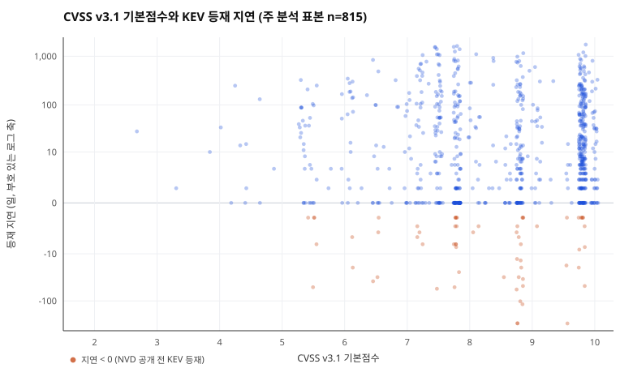
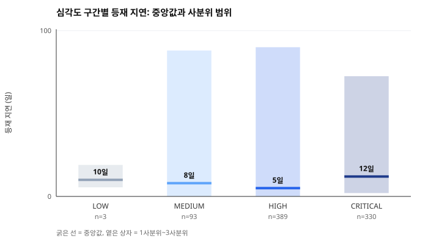

# CVSS 점수는 악용 확인 시점을 예고하는가

## CISA KEV 카탈로그 815건에 대한 사전등록 재분석

**작성자** whiteclover0542

**작성일** 2026년 9월 8일

**데이터 스냅샷** 2026년 9월 8일 (CISA KEV catalogVersion 2026.09.04)

**재현 패키지** 이 논문과 함께 배포되는 `data/`, `scripts/`, `REPRODUCE.md`

---

## 초록

보안 실무는 한정된 인력으로 어떤 취약점을 먼저 고칠지 정해야 하고, 그 기준으로 CVSS 점수를 널리 쓴다.
선행 연구는 CVSS가 "악용될 것인가"를 잘 예측하지 못한다고 보고했지만, "악용이 **언제** 확인되는가",
즉 시점과의 관계는 따로 확인된 적이 드물다. 이 연구는 CVSS v3.1 기본점수가 높을수록 취약점 공개일부터
CISA KEV(실제 악용 확인 목록) 등재일까지 걸린 일수가 짧을 것이라는 가설을 세우고, 분석 방법과 판정 기준을
데이터의 관계를 보기 전에 확정한 뒤 검증했다. CISA KEV 카탈로그 전수 1,695건과 NVD CVE API 2.0을
결합했고, KEV 창설(2021-11-03) 이전에 공개된 CVE는 소급 등재로 지연이 왜곡되므로 제외해 815건을 주 표본으로 삼았다.
결과는 가설과 달랐다. Spearman 순위상관은 ρ = +0.0526(95% CI −0.017 ~ +0.122, p = 0.1333)으로
방향이 예측과 반대였고 크기가 0에 가까웠다. 표본을 네 가지로 바꿔 다시 계산해도 |ρ|는 모두 0.1 이하였다.
심각도 구간별 차이는 통계적으로 유의했으나(Kruskal-Wallis p = 0.0409) 효과크기가 ε² = 0.0101로
순위 분산의 1%에 그쳤고, 가장 빠른 집단은 CRITICAL이 아니라 HIGH(중앙값 5일)였으며 CRITICAL이 12일로 가장 느렸다.
사전에 정한 기준에 따라 가설을 기각한다. 다만 이 표본은 이미 악용이 확인된 취약점만 모여 있어
CVSS의 88.2%가 7.0 이상에 몰려 있고(표준편차 1.40), 이 범위 제한이 결과의 유력한 설명이다.
부수적으로 표본의 26.5%가 NVD 공개 당일 또는 그 이전에 KEV에 등재됐고, 63건(7.7%)은 NVD가 CVE를
공개하기도 전에 등재됐다. 점수를 확인한 뒤 대응 순서를 정하는 방식으로는 이 사례들을 제때 다룰 수 없다.

**주제어** 취약점 관리, CVSS, CISA KEV, 악용 확인 시점, 사전등록 분석, 재현 가능 연구

---

## 1. 서론

### 1.1 문제의식

조직이 한 달에 마주하는 취약점은 사람이 다 고칠 수 있는 수를 넘는다. 그래서 순서를 정해야 하고,
가장 널리 쓰이는 기준이 CVSS(Common Vulnerability Scoring System) 기본점수다. 0.0부터 10.0까지의
숫자 하나로 심각도를 나타내며, 많은 조직이 "9.0 이상부터 먼저"와 같은 규칙을 쓴다.

그런데 이 규칙이 전제하는 것이 있다. 점수가 높은 것이 실제로 더 급하다는 전제다.
Allodi와 Massacci(2014)는 이 전제를 사례-대조 연구로 검증해, 높은 CVSS 점수만 보고 고치는 것이
무작위로 골라 고치는 것과 다르지 않다고 보고했다. Jacobs 등(2021)은 CVSS 대신 데이터로 학습한
악용 확률(EPSS)을 제안하며 같은 문제의식을 이어받았다.

이 연구들이 다룬 질문은 "**이 취약점이 악용될 것인가**"다. 그러나 실무에서 순서를 정할 때 필요한 것은
그것만이 아니다. 악용될 것이 확실한 취약점들 사이에서도 **무엇을 먼저 할지**를 정해야 한다.
그렇다면 이렇게 물을 수 있다. 이미 악용이 확인된 취약점들 사이에서, CVSS 점수가 높은 것이 더 빨리
악용으로 확인되는가? 점수가 시급성의 신호 역할을 하는가?

### 1.2 이 연구가 새로 확인하는 것

이미 알려진 것과 이 연구가 확인하려는 것은 다음과 같이 나뉜다.

| 이미 알려진 것 | 이 연구가 확인하는 것 |
| --- | --- |
| CVSS는 악용 **여부**의 예측 지표로서 성능이 낮다 (Allodi & Massacci, 2014) | 악용 **시점**과의 관계는 별개 문제다. 예측력이 낮아도 시급성 신호는 남아 있을 수 있다 |
| 악용 확률은 데이터로 예측할 수 있다 (Jacobs et al., 2021) | 확률 모델이 아니라, 실무자가 실제로 손에 쥔 CVSS 점수 하나로 순서를 정할 때 시간적으로 유리한지를 본다 |
| CVE 공개 후 익스플로잇 가용까지의 시간 분포가 있다 (Householder et al., 2020) | 익스플로잇 "가용성"이 아니라 미국 정부가 실제 악용을 확인해 공표한 시점(KEV)까지의 시간을 쓴다 |
| 점수 체계들은 서로 다른 우선순위를 낸다 (Koscinski et al., 2025) | 체계 간 비교가 아니라 CVSS 단독으로 KEV 등재 지연을 설명할 수 있는지를 본다 |

확인한 범위에서, KEV 카탈로그 창설 이후 공개된 CVE만으로 소급 등재 편향을 제거하고 이 관계를 본
공개 연구는 없었다.

### 1.3 가설

> **CVSS v3.1 기본점수가 높은 취약점일수록, 취약점 공개일로부터 CISA KEV 등재일까지 걸린 일수가 짧다.**

- 영향을 주는 것(독립변수): CVSS v3.1 기본점수
- 영향을 받는 것(종속변수): 공개일에서 KEV 등재일까지의 일수(등재 지연)
- 예측 방향: 점수가 높을수록 지연이 짧다(음의 상관)

**이 가설이 틀렸다면** ρ가 0 근처(|ρ| ≤ 0.1)이거나 오히려 양수로 나오고, 심각도 구간별 지연 중앙값이
서로 겹치거나 순서가 뒤집힌다.

---

## 2. 방법

### 2.1 데이터

두 공개 데이터를 2026년 9월 8일에 내려받아 스냅샷으로 고정했다. 둘 다 계정이나 API 키가 필요 없다.

| 데이터 | 제공 기관 | 받은 날짜 | 건수 |
| --- | --- | --- | --- |
| Known Exploited Vulnerabilities Catalog (catalogVersion 2026.09.04) | CISA | 2026-09-08 | 1,695 |
| NVD CVE API 2.0, `hasKev` 필터 | NIST NVD | 2026-09-08 | 1,695 |

KEV 카탈로그는 등재일(`dateAdded`)과 벤더·제품을 주지만 CVSS 점수와 공개일이 없다. NVD는 그 둘을 준다.
NVD API의 `hasKev` 필터를 쓰면 KEV에 오른 CVE만 한 번의 요청으로 받을 수 있다. 두 목록의 CVE ID는
1,695건이 **매칭 실패 없이 1:1로 대응**했다.

### 2.2 변수 정의

| 변수 | 정의 | 출처 필드 |
| --- | --- | --- |
| CVSS 점수 (독립) | CVSS v3.1 기본점수, 0.0~10.0 | NVD `cvssMetricV31[].cvssData.baseScore` |
| 심각도 구간 | LOW / MEDIUM / HIGH / CRITICAL | NVD `baseSeverity` |
| 공개일 | 취약점이 NVD에 공개된 날 | NVD `cve.published` |
| 악용 확인일 | CISA가 KEV에 등재한 날 | KEV `dateAdded` |
| **등재 지연 (종속)** | `dateAdded − published`, 일 단위 정수 | 위 둘의 차 |

같은 CVE에 점수가 여러 개면 NVD 자체 평가(Primary)를 우선했다. CVSS v3.1만 쓰고 v2·v4는 쓰지 않았다.
기준일은 `published` 하나만 쓰고 `lastModified`는 쓰지 않았다.

### 2.3 표본 선정

KEV 카탈로그는 2021년 11월 3일에 신설되면서 과거 취약점을 소급 등재했다. 가장 오래된 것은
CVE-2002-0367로, 2002년에 공개되어 2022년에 등재됐다(지연 7,191일). 이런 건의 "지연"은 악용 속도가 아니라
카탈로그가 언제 만들어졌는지를 재는 값이 된다. 그래서 **KEV 창설일 이후에 공개된 CVE만** 주 표본으로 삼았다.

| 단계 | 건수 |
| --- | --- |
| KEV 카탈로그 전수 | 1,695 |
| CVSS v3.1 점수 보유 | 1,691 (결측 4건) |
| 2021-11-03 이후 공개 | 818 |
| **주 분석 표본** (위 둘을 모두 만족) | **815** |

전수 1,691건은 민감도 분석으로 함께 보고한다.

### 2.4 분석 방법과 판정 기준 (사전 확정)

**분석 방법과 판정 기준은 데이터의 관계를 계산하기 전에 확정했다.** 확정 전에 확인한 것은 표본 수와
결측 여부뿐이다. 결과를 본 뒤 유리한 방법을 고르는 일을 막기 위해서다.

- 주 분석: CVSS 점수와 등재 지연의 **Spearman 순위상관**. 지연 분포가 크게 치우칠 것이 예상되어 순위 기반을 택했다. 95% 신뢰구간은 5,000회 부트스트랩(seed 20260908)으로 구했다.
- 보조 분석: 심각도 4구간별 지연 **중앙값** 비교와 **Kruskal-Wallis** 검정(동순위 보정 포함).
- **판정 기준**: ρ < −0.1 이고 p < 0.05면 가설 지지 / |ρ| ≤ 0.1이면 관계 없음 / ρ > 0.1이면 가설과 반대.
- 제외 규칙: CVSS v3.1 점수가 없는 건은 주 분석에서 제외하되 건수를 보고한다. **지연이 음수인 건은 제외하지 않고 그대로 두고 별도로 보고한다.**

### 2.5 도구

분석은 Python 3.11 **표준 라이브러리만으로** 수행했다. scipy·pandas·numpy를 쓰지 않고
Spearman 상관, Kruskal-Wallis, t분포·카이제곱 분포 꼬리 확률, 부트스트랩을 직접 구현했다(`scripts/stats.py`).
재현하는 사람이 아무것도 설치하지 않게 하기 위해서다. 구현이 맞는지는 손으로 계산할 수 있는 값과
공표된 임계값에 대조해 검증했다(`scripts/test_stats.py`, 22개 검사 전부 통과). 그래프도
외부 라이브러리 없이 SVG로 직접 그렸다.

---

## 3. 결과

### 3.1 등재 지연의 분포

주 표본 815건의 등재 지연은 중앙값 8일, 1사분위 0일, 3사분위 85일이었다.
평균은 99.9일로 중앙값보다 훨씬 큰데, 오른쪽으로 길게 늘어진 분포이기 때문이다(최대 1,727일).

| n | 평균 | 표준편차 | 최소 | 1사분위 | 중앙값 | 3사분위 | 최대 |
| --- | --- | --- | --- | --- | --- | --- | --- |
| 815 | 99.9 | 238.4 | −290 | 0 | 8 | 85 | 1,727 |

**표 1. 등재 지연 분포 (단위: 일)**

전체의 26.5%가 지연 0일 이하, 즉 NVD 공개 당일 또는 그 이전에 KEV에 등재됐다. 30일 이내는 63.2%였다.

### 3.2 주 분석 — CVSS 점수와 등재 지연의 상관



**그림 1.** CVSS v3.1 기본점수와 KEV 등재 지연(주 분석 표본 815건). 세로축은 지연이 음수부터
수천 일까지 걸쳐 있어 부호 있는 로그 축을 썼다. 주황색 점은 지연이 음수인 63건이다.
점수 축 방향으로 뚜렷한 기울기가 보이지 않는다.

| 표본 | n | ρ | 95% 신뢰구간 | p | 사전 기준에 따른 판정 |
| --- | --- | --- | --- | --- | --- |
| **주 분석**: KEV 창설 이후 공개분 | 815 | **+0.0526** | [−0.017, +0.122] | 0.1333 | **관계 없음** |
| 민감도 1: 전수(소급 등재 포함) | 1,691 | −0.0381 | [−0.085, +0.008] | 0.1176 | 관계 없음 |
| 민감도 2: 주 표본에서 음수 지연 제외 | 752 | +0.0203 | [−0.050, +0.091] | 0.5791 | 관계 없음 |

**표 2. Spearman 순위상관 (사전 확정 분석)**

주 분석의 ρ는 +0.0526으로 **예측한 방향(음수)과 반대**였고, p = 0.1333으로 유의하지 않았다.
95% 신뢰구간 [−0.017, +0.122]는 0을 포함한다. 표본을 바꾼 두 민감도 분석에서도 |ρ| ≤ 0.1이었다.

### 3.3 심각도 구간별 비교



**그림 2.** 심각도 구간별 등재 지연의 중앙값과 사분위 범위(주 분석 표본 815건).

| 심각도 | n | 중앙값 | 1사분위 | 3사분위 | 평균 | 30일 이내 | 지연 음수 |
| --- | --- | --- | --- | --- | --- | --- | --- |
| LOW | 3 | 10일 | 6 | 19 | 13.0 | 100.0% | 0.0% |
| MEDIUM | 93 | 8일 | 0 | 88 | 65.6 | 61.3% | 11.8% |
| HIGH | 389 | **5일** | 0 | 90 | 119.6 | 64.5% | 9.8% |
| CRITICAL | 330 | **12일** | 2 | 72 | 87.1 | 61.8% | 4.2% |

**표 3. 심각도 구간별 등재 지연**

Kruskal-Wallis 검정 결과 H = 8.262, df = 3, **p = 0.0409**로 집단 간 차이가 통계적으로 유의했다.
그러나 효과크기는 **ε² = 0.0101**로, 순위 분산의 약 1%만 설명한다. 그리고 차이의 방향이 가설과 어긋난다.
가장 빨리 등재된 것은 CRITICAL이 아니라 HIGH(중앙값 5일)였고, **CRITICAL이 12일로 가장 느렸다.**
사분위 범위는 네 집단이 크게 겹친다.

### 3.4 가설과 다르게 나온 결과 (전부 수록)

가설과 어긋나는 결과를 빠짐없이 싣는다.

1. **상관의 부호가 예측과 반대다.** 예측은 음수, 실제는 +0.0526.
2. **심각도별 중앙값이 단조적이지 않다.** HIGH(5일) < MEDIUM(8일) < LOW(10일) < CRITICAL(12일).
3. **Kruskal-Wallis는 유의하지만 효과가 없다시피 하다.** p = 0.0409, ε² = 0.0101.
4. **63건(7.7%)에서 지연이 음수였다.** NVD가 CVE를 공개하기 전에 KEV에 등재된 것이다. 최대 −290일.
   예: CVE-2022-26485(Mozilla)는 KEV 등재 2022-03-07, NVD 공개 2022-12-22.
5. **랜섬웨어 사용 이력이 지연을 가르지 않았다.** 랜섬웨어 캠페인에 쓰인 것으로 알려진 162건과
   나머지 653건의 지연 중앙값이 **둘 다 8일**로 같았다.

### 3.5 사후 추가 분석 (사전 계획 아님)

아래 둘은 결과를 본 뒤에 추가한 탐색적 분석이다. 사전 분석과 구분해 보고한다.

| 하위표본 | n | ρ | 95% 신뢰구간 | p | 판정 |
| --- | --- | --- | --- | --- | --- |
| NVD 자체 평가 점수만 | 532 | −0.0247 | [−0.112, +0.061] | 0.5702 | 관계 없음 |
| 2024년 이후 공개분만 | 493 | +0.0809 | [−0.005, +0.170] | 0.0727 | 관계 없음 |

**표 4. 사후 추가 분석 (탐색적)**

점수의 출처를 NVD 자체 평가로 좁혀도, 기간을 최근으로 좁혀도 결론은 같았다.
**사전 분석과 사후 분석을 합쳐 다섯 개 표본 모두에서 |ρ| ≤ 0.1이었다.**

---

## 4. 논의

### 4.1 판단

**데이터는 가설을 뒷받침하지 않는다. 사전에 정한 기준에 따라 가설을 기각한다.**

판정 기준은 "ρ < −0.1 이고 p < 0.05면 지지"였다. 실제 값은 ρ = +0.0526, p = 0.1333으로 크기·방향·유의성
셋 다 조건을 만족하지 않는다. 신뢰구간이 0을 포함하므로 "약한 관계인데 표본이 모자라 못 잡았다"고 보기도
어렵다. 구간의 양 끝이 모두 ±0.13 안에 있어, 설령 관계가 있더라도 실무에서 쓸 만한 크기가 아니다.

심각도 비교에서 Kruskal-Wallis가 유의하게 나온 것은 가설을 지지하는 근거가 **아니다.** 방향이 가설과
어긋나고(CRITICAL이 가장 느림), 효과크기가 1%다. n이 815로 크면 무시할 만한 차이도 유의해질 수 있다.

### 4.2 왜 이렇게 나왔는가 — 검토한 가능성

**① 범위 제한 (데이터로 확인함, 가장 유력)**

KEV 카탈로그는 정의상 이미 악용이 확인된 취약점만 모은다. 그래서 CVSS 점수가 높은 쪽에 쏠려 있다.

| 구간 | 건수 | 비율 |
| --- | --- | --- |
| 0.0–3.9 (LOW) | 3 | 0.4% |
| 4.0–6.9 (MEDIUM) | 93 | 11.4% |
| 7.0–8.9 (HIGH) | 389 | 47.7% |
| 9.0–10.0 (CRITICAL) | 330 | 40.5% |

**표 5. 주 표본의 CVSS 점수 분포** (평균 8.44, 표준편차 1.40)

**88.2%가 7.0 이상**이고 LOW는 3건뿐이다. 독립변수가 이렇게 좁은 구간에 몰리면 상관계수는 구조적으로
0에 가까워진다. 이 연구가 답할 수 있는 것은 "**이미 악용된 것들 사이에서** 점수가 시점을 가르는가"이지,
"점수가 악용 여부를 예측하는가"가 아니다.

**② 종속변수가 악용 시점이 아니라 확인·공표 시점이다 (기관 문서로 뒷받침, 이 데이터로는 검증 불가)**

BOD 22-01은 KEV 등재 요건으로 악용 증거 외에 **CVE ID 부여와 명확한 조치 지침**도 요구한다(CISA, 2021).
등재일은 CISA가 증거를 모으고 절차를 밟은 결과이지 공격이 시작된 날이 아니다. 이 절차는 CVSS 점수와
무관하게 진행되므로 지연에 점수와 상관없는 잡음이 크게 섞인다. 지연의 사분위 범위가 0~85일로 넓고
90백분위가 277일인 것이 그 잡음의 크기를 보여준다. **다만 이것은 해석 후보이며 이 데이터로 검증하지 않았다.**

**③ 기준일이 실제 공개일이 아니다 (데이터로 확인함)**

음수 지연 63건이 직접적인 증거다. NVD `published`는 **NVD가 레코드를 만든 날**이지 벤더가 취약점을
알린 날이 아니다. Mozilla CVE-2022-26485는 KEV 등재보다 NVD 공개가 9개월 늦었다. Ruohonen(2018)이
보고한 NVD 처리 지연과 같은 현상이다. 종속변수의 기준선이 흔들리므로 상관이 희석된다.

**④ CVSS 기본점수에 악용 정보가 원래 없다 (선행 연구와 일치)**

CVSS v3.1 기본점수는 공격 벡터·복잡도·영향 범위 등 취약점의 구조적 속성만으로 계산된다(FIRST, 2019).
공격자가 그것을 실제로 쓸지, 언제 쓸지는 들어가지 않는다. Allodi와 Massacci(2014)의 결론과 방향이 같으며,
이 연구는 그 결론이 악용 여부뿐 아니라 **악용 확인 시점에도 적용된다**는 점을 더한다.

### 4.3 가설을 고치지 않은 이유

결과를 보고 가설을 데이터에 맞게 고치면, 기각된 결과를 지지된 결과로 바꾸는 일이 된다.
가설 문장은 사전에 등록한 그대로 두었고, 기각 자체를 결론으로 삼았다. 데이터를 본 뒤 추가한 분석은
3.5절에 "사후 추가, 탐색적"으로 분리해 표시했다.

다음 연구를 위한 가설을 하나 남긴다 — "KEV 등재 지연은 취약점의 속성보다 CISA의 확인 절차에
더 크게 좌우된다." **이 연구는 이것을 검증하지 않았다.** 검증하려면 벤더 최초 공지일 같은 외부 기준일이
필요한데 이 데이터에는 없다.

### 4.4 결론

CISA KEV 카탈로그에 등재된 815건(2021-11-03 이후 공개분)을 대상으로 확인한 결과,
**CVSS v3.1 기본점수와 KEV 등재 지연 사이에는 실질적인 관계가 없었다.** Spearman ρ는 +0.0526
(95% CI −0.017 ~ +0.122, p = 0.1333)으로 방향은 가설과 반대였고 크기는 0에 가까웠다. 표본을 네 가지
방식으로 바꿔 다시 계산해도 |ρ|는 모두 0.1 이하였다. 심각도 구간별로는 통계적으로 유의한 차이가
나왔지만(p = 0.0409) 효과크기가 순위 분산의 1%에 그쳤고, 방향도 단조롭지 않았다.

이 결과가 실무에 뜻하는 바는 좁고 분명하다. **이미 악용이 확인된 취약점들 사이에서, CVSS 점수는
어느 것이 더 급한지를 알려주지 않는다.** 점수가 9.8이라고 해서 7.5짜리보다 먼저 악용이 확인되지는 않았다.
다만 이것은 CVSS가 쓸모없다는 뜻이 아니다. 이 데이터는 악용된 것만 모여 있어 "점수가 악용 여부를
가르는가"라는 질문에는 답할 수 없다. 답할 수 있는 것은 시점에 관한 것뿐이다.

부수적인 관찰 하나를 덧붙인다. 표본의 26.5%가 NVD 공개 당일 또는 그 이전에 KEV에 등재됐고,
63건(7.7%)은 NVD가 CVE를 공개하기도 전에 등재됐다. 점수를 확인한 뒤 대응 순서를 정하는 절차로는
이 사례들을 제때 다룰 수 없다. 이 부분에 대해서는 KEV 등재 자체를 신호로 삼는 편이 점수를 기다리는 것보다 빠르다.

### 4.5 한계

1. **표본이 악용된 것만 모여 있다(case-only).** 악용되지 않은 CVE와 비교하지 않았으므로, CVSS가 악용 여부를 예측하는지에 대해서는 이 연구가 아무 말도 할 수 없다.
2. **독립변수의 분산이 작다.** 표준편차 1.40, 88.2%가 7.0 이상이다. 관계가 있더라도 이 범위에서는 검출하기 어렵다.
3. **종속변수가 악용 시점이 아니다.** KEV `dateAdded`는 CISA가 확인·공표한 날이며, 실제 공격 시작일은 이 데이터에 없다.
4. **기준일이 불안정하다.** NVD `published`는 NVD의 레코드 생성일이고, 63건에서 KEV 등재보다 늦었다.
5. **점수의 출처가 섞여 있다.** 815건 중 283건은 NVD 자체 평가가 아닌 2차 출처(CNA) 점수다. 자체 평가분만으로 다시 계산해도 결론은 같았으나(ρ = −0.0247), 두 출처의 채점 기준이 같다는 보장은 없다.
6. **점수의 시점이 다르다.** 오늘 조회한 점수는 그 취약점이 악용되던 당시에는 없었을 수 있다(Ruohonen, 2018).
7. **관측 기간 중 제도가 바뀌었다.** BOD 22-01이 2026년 6월 10일 BOD 26-04로 대체됐다(CISA, 2026b). 등재 운영 변화가 후반부 데이터에 영향을 줬을 수 있으나 기간을 나누어 보지 않았다.
8. **스냅샷 한 장이다.** 2026-09-08 기준이며, KEV는 계속 갱신되므로 나중에 받으면 수치가 달라진다.
9. **상관은 인과가 아니다.** 관계가 없다는 결과는 "점수가 시점을 정하지 않는다"는 것이지, 무엇이 시점을 정하는지는 말해 주지 않는다.

---

## 5. 참고문헌

Allodi, L., & Massacci, F. (2014). Comparing vulnerability severity and exploits using case-control studies. *ACM Transactions on Information and System Security, 17*(1). https://doi.org/10.1145/2630069

Cybersecurity and Infrastructure Security Agency. (2021). *Binding Operational Directive 22-01: Reducing the significant risk of known exploited vulnerabilities* (2026년 6월 10일 폐지). https://www.cisa.gov/news-events/directives/bod-22-01-reducing-significant-risk-known-exploited-vulnerabilities

Cybersecurity and Infrastructure Security Agency. (2026a). *Known exploited vulnerabilities catalog* (catalogVersion 2026.09.04) [데이터 세트]. https://www.cisa.gov/known-exploited-vulnerabilities-catalog

Cybersecurity and Infrastructure Security Agency. (2026b). *Binding Operational Directive 26-04: Prioritizing security updates based on risk*. https://www.cisa.gov/news-events/directives/bod-26-04-prioritizing-security-updates-based-risk

Forum of Incident Response and Security Teams. (2019). *Common Vulnerability Scoring System v3.1: Specification document*. https://www.first.org/cvss/v3.1/specification-document

Householder, A. D., Chrabaszcz, J., Novelly, T., Warren, D., & Spring, J. M. (2020). Historical analysis of exploit availability timelines. *13th USENIX Workshop on Cyber Security Experimentation and Test (CSET '20)*. https://www.usenix.org/conference/cset20/presentation/householder

Jacobs, J., Romanosky, S., Edwards, B., Adjerid, I., & Roytman, M. (2021). Exploit Prediction Scoring System (EPSS). *Digital Threats: Research and Practice, 2*(3). https://doi.org/10.1145/3436242 (무료 전문: https://arxiv.org/abs/1908.04856)

Koscinski, V., Nelson, M., Okutan, A., Falso, R., & Mirakhorli, M. (2025). *Conflicting scores, confusing signals: An empirical study of vulnerability scoring systems* (arXiv:2508.13644). https://arxiv.org/abs/2508.13644

National Institute of Standards and Technology. (2026). *National Vulnerability Database, CVE API 2.0* [데이터 세트]. https://nvd.nist.gov/vuln

Ruohonen, J. (2018). *A look at the time delays in CVSS vulnerability scoring* (arXiv:1801.00938). https://arxiv.org/abs/1801.00938

### 5.1 출처를 확인한 방법

모든 문헌을 2026년 9월 8일에 다음 절차로 확인했다.

1. **서지정보 대조** — 제목·저자·연도·권호를 Crossref API(`api.crossref.org/works/{DOI}`)에서 받아 대조했다. 검색 결과 화면이 아니라 등록기관 데이터를 기준으로 삼았다.
2. **초록 원문 확인** — Semantic Scholar API, arXiv API, 또는 학회 공식 페이지에서 초록을 직접 읽었다. 본문에 옮긴 내용은 초록 문장과 직접 대조했다.
3. **링크 생존 확인** — 목록의 모든 URL에 HTTP 상태 코드를 확인했다. 404가 나온 항목은 뺐고, 리다이렉트가 나온 항목은 최종 URL을 확인했다(이 과정에서 BOD 22-01의 폐지를 발견했다).
4. **접근성 확인** — 로그인 없이 열리는지 확인했다. ACM Digital Library에 실린 두 편(Allodi & Massacci, Jacobs et al.)은 자동화 접근을 차단하지만 사람이 브라우저로 열면 초록 페이지가 보인다. 본문 전체는 구독이 필요할 수 있다. 나머지 문헌은 무료 전문 공개다.

**목록에서 뺀 것**

- runZero, "KEVology: An analysis of CISA KEV exploits, scores, & timelines"(2026): 실재하고 주제가 가장 가깝지만, 동료심사를 거치지 않은 업체 리포트이고 데이터·코드가 공개되어 있지 않아 수치를 검증할 수 없어 뺐다.
- 검색 요약이 Koscinski 등(2025)의 것이라며 제시한 KEV·EPSS 관련 수치("KEV 등재 전 EPSS 0.5를 넘긴 CVE가 20% 미만" 등): 초록 원문을 열어 대조했더니 KEV라는 단어 자체가 없었다. 해당 논문은 초록에서 확인된 내용만 인용하고 이 수치들은 쓰지 않았다.
- FIRST EPSS 모델 설명 페이지(`first.org/epss/model`): HTTP 404로 링크가 죽어 있어 뺐다. EPSS 근거는 동료심사를 거친 Jacobs 등(2021)으로 대체했다.

---

## 6. 재현 방법

자세한 절차는 함께 배포되는 `REPRODUCE.md`에 있다. 요약하면 다음과 같다.

**필요한 것:** Python 3.8 이상. 그 외에 설치할 것이 없다(외부 패키지를 쓰지 않는다).

```
python scripts/test_stats.py      # 통계 구현 검증 (22개 검사)
python scripts/build_dataset.py   # 원자료 결합 -> data/processed/kev_delay.csv
python scripts/analyze.py         # 분석 -> results.json, results.md, 그래프 2장
```

원자료(`data/raw/kev_2026-09-08.json`, `data/raw/nvd_kev_2026-09-08.json`)가 패키지에 들어 있으므로
네트워크 없이 논문의 모든 수치와 그래프가 그대로 재생성된다. 데이터를 새로 받으려면
`python scripts/fetch_data.py`를 실행하면 되지만, KEV는 계속 갱신되므로 수치가 이 논문과 달라진다.

---

## 부록 A. AI와 나의 판단

**AI에게 맡긴 일:** 관심 분야에서 후보 질문 10개 뽑기, 두 공개 데이터의 필드 구조 조사와 결합 방법 찾기,
Spearman·Kruskal-Wallis·부트스트랩을 표준 라이브러리로 구현하기, 표와 SVG 그래프 생성 코드 작성,
문헌 검색과 초록 요약.

**내가 직접 판단한 일:** 후보 10개 중 무엇을 남기고 무엇을 접을지, 분석 방법과 판정 기준을 데이터를 보기 전에
확정한다는 원칙, KEV 창설일로 표본을 자르는 결정, 기각된 결과를 그대로 결론으로 삼고 가설을 고치지 않는다는 결정,
사후 추가 분석을 사전 분석과 분리해 표시하는 결정, 그리고 한계 아홉 가지를 무엇으로 잡을지.

**AI 결과를 받아들이지 않고 고친 지점:** ① AI의 첫 수집 설계는 CVE를 하나씩 조회하는 방식이라 3시간이
걸렸다 — `hasKev` 필터로 바꿔 한 번의 요청으로 줄였다. ② AI는 KEV 소급 등재 문제를 먼저 지적하지 않았다 —
NVD 응답 첫 레코드에서 2002년 CVE를 발견하고서야 드러났고, 표본 제한 결정으로 이어졌다.
③ 검색 요약이 Koscinski 등(2025)의 내용이라며 알려준 KEV 관련 수치가 초록에 없었다 — 인용에서 제외했다.
④ Kruskal-Wallis가 p = 0.0409로 유의하게 나왔을 때 이를 "부분적 지지"로 쓰지 않았다 — 효과크기를
계산하니 1%였고 방향도 반대였다.
